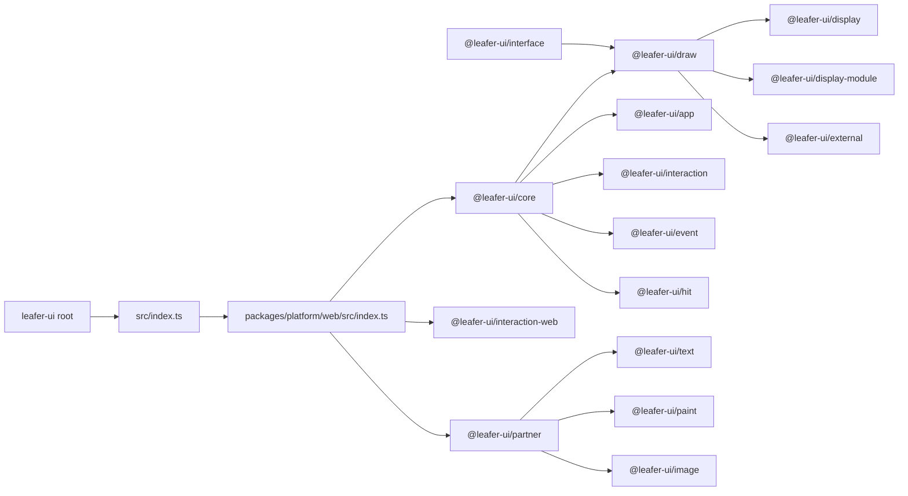
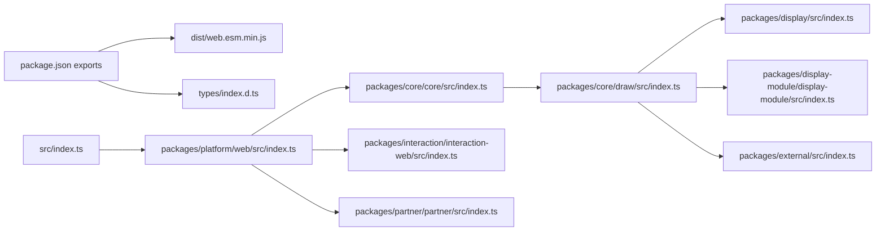
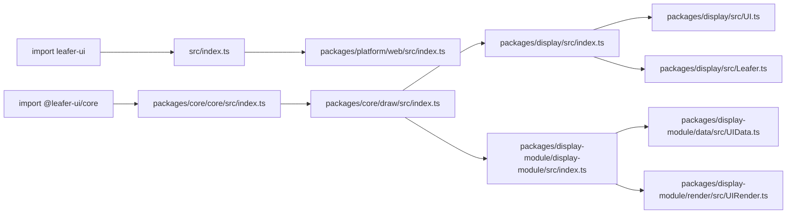
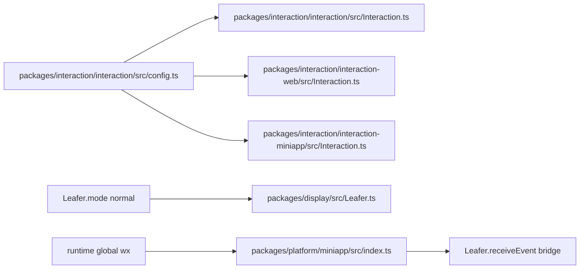
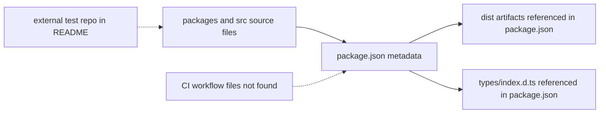
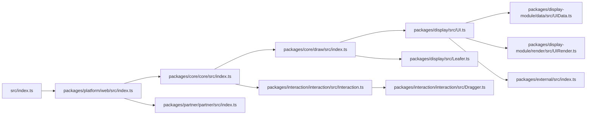

# leafer-ui AI / RAG 代码索引

## 1. 索引目标与适用查询场景摘要

- 目标：为 AI 代码问答、RAG 检索、新人导航、维护交接提供稳定的文件级、符号级、查询意图级索引。
- 适用查询：`入口在哪里`、`这个文件干什么`、`某个类型定义在哪`、`默认导出链怎么走`、`交互配置影响哪些模块`、`应该先看哪些文件`。
- 输出物：
  - `docs/leafer-ui-ai-index.md`
  - `docs/leafer-ui-ai-index.records.jsonl`
  - `docs/leafer-ui-file-tree.txt`
- 覆盖范围：排除 `docs/` 与常见生成目录后，共覆盖 `246` 个文件；`records.jsonl` 中已为这 `246` 个文件逐一生成 `file_record`。
- 重点：根入口、平台入口、聚合导出链、类型契约、核心运行时类、插件占位、交互配置、示例、缺失项。

## 2. 项目类型识别结果与依据

| 识别结果 | 结论 | 依据 |
| --- | --- | --- |
| 主类型 | `library / sdk` | 根 `package.json` 定义了 `main`、`exports`、`types`，面向 npm 发布 |
| 结构形态 | `多包源码仓库` | `packages/**/package.json` 中存在多个独立包，如 `@leafer-ui/web`、`@leafer-ui/core`、`@leafer-ui/interface` |
| workspace 形态 | `非典型 workspace monorepo`【推断】 | 未发现 `pnpm-workspace.yaml`、`turbo.json`、`nx.json`、`workspaces` 字段，但源码按多包组织 |
| 运行时类型 | `hybrid runtime library` 更贴切 | 同时存在 web、node、miniapp、worker、canvaskit 平台入口，但没有前后端应用路由/页面/服务结构 |
| 默认入口 | 浏览器平台 | `src/index.ts` 只有一行：`export * from '@leafer-ui/web'` |

## 3. 索引目录框架

1. 索引范围、排除项与项目全景
2. 文件级索引
3. 符号级索引
4. 结构关系索引
5. 特殊热点索引
6. tests / examples / scripts / CI 索引
7. 查询词典与检索路由
8. 机器可读导出设计
9. 索引质量要求

## 4. 需要生成的 Mermaid 图清单

- package / module / file 映射图
- 入口链 / 导出链关系图
- 公共导出 -> 实现 -> 类型定义映射图
- config / runtime key -> file 影响图
- 核心文件依赖图
- build / test / release / CI 流程图

## 5. 机器可读索引设计摘要

- 实际生成文件：`docs/leafer-ui-ai-index.records.jsonl`
- 当前已落地记录：
  - `file_record`：`246` 条，覆盖每个文件
  - 补充样例记录：`symbol_record`、`route_record`、`config_record`、`query_route_record`
- 设计目标：
  - `file_record` 负责“按文件查”
  - `symbol_record` 负责“按导出符号查”
  - `query_route_record` 负责“按查询意图查”
- 说明：当前 JSONL 以“全量文件覆盖”为第一优先级；符号/路由/配置记录已经提供样例，适合作为下一步扩展基线。

# 第一部分：索引范围、排除项与项目全景

## 1. 索引目标、范围、排除项

### 1.1 覆盖范围

- 覆盖目录：仓库根文件、`contributor/`、`packages/`、`src/`
- 覆盖对象：源码、文档、示例、LICENSE、package 元数据、仓库配置
- 全量文件覆盖基线：`docs/leafer-ui-ai-index.records.jsonl`

### 1.2 排除项

- 明确排除：`docs/`、`.git/`、`node_modules/`、`dist/`、`build/`、`coverage/`、`.next/`、`.nuxt/`、`.turbo/`、`out/`
- 当前仓库实际存在的排除目录：`.git/`、`docs/`
- 说明：`docs/leafer-ui-architecture.md` 与本次生成索引都属于派生文档，不应反向污染源码索引

### 1.3 缺失但必须说明的线索

- 未发现锁文件：`pnpm-lock.yaml` / `package-lock.json` / `yarn.lock` / `bun.lockb`
- 未发现 workspace 文件：`pnpm-workspace.yaml` / `turbo.json` / `nx.json` / `lerna.json`
- 未发现 `tsconfig*.json`
- 未发现 CI：`.github/workflows/*`
- 未发现 `.env*`
- 未发现仓库内 `tests/` / `e2e/`
- `README.md` 明确指向外部仓库：
  - `LeaferJS` 主集成仓库
  - `test` 自动化测试仓库
  - `docs` 在线文档仓库

### 1.4 对 AI 检索的价值

- 明确哪些问题可以在本仓库直接回答，哪些需要跳到外部仓库。
- 避免把 `dist`、CI、测试、构建脚本误写成本仓库内事实。

### 1.5 关键源码证据

- `package.json`
- `src/index.ts`
- `README.md`
- 仓库目录扫描结果

### 1.6 待确认项

- `dist` 和 `types` 的生成链路在何处维护【待确认】
- CI / release / test 是否全部位于外部仓库【待确认】

## 2. workspace / package / module / file 全量地图

### 2.1 workspace 根职责

| 区域 | 作用 |
| --- | --- |
| 根目录 | npm 根包元数据、README、LICENSE、默认入口 `src/index.ts` |
| `packages/` | 多个可发布子包的源码 |
| `contributor/` | 社区贡献规范与示例代码 |
| `docs/` | 本次生成的派生索引文档，已排除出源码索引 |

### 2.2 完整文件树

- 完整树文件：`docs/leafer-ui-file-tree.txt`
- 说明：该文件按源码作用域输出完整树，排除了 `docs/` 和 `.git/`

顶层摘要：

```text
.
├── contributor/
├── packages/
├── src/
├── .gitignore
├── LICENSE
├── package.json
└── README.md
```

### 2.3 package 全量地图

| package / 区域 | 文件数 | 职责 | 建议先看 |
| --- | ---: | --- | --- |
| `leafer-ui/root` | 5 | 根发布元数据与默认导出入口 | `package.json`, `src/index.ts` |
| `contributor` | 2 | 社区规范文档 | `contributor/CODE_OF_CONDUCT.md` |
| `contributor/code` | 3 | 仓库内唯一显式示例 | `contributor/code/Checkerboard.ts` |
| `packages/app` | 5 | App 容器层 | `packages/app/src/App.ts` |
| `packages/core/core` | 4 | 核心聚合入口 | `packages/core/core/src/index.ts` |
| `packages/core/draw` | 4 | 绘制运行时聚合入口 | `packages/core/draw/src/index.ts` |
| `packages/decorator` | 5 | 装饰器与元数据 | `packages/decorator/src/index.ts` |
| `packages/display` | 19 | UI / Leafer / 图元类 | `packages/display/src/index.ts`, `packages/display/src/UI.ts`, `packages/display/src/Leafer.ts` |
| `packages/display-module/bounds` | 5 | 边界计算模块 | `packages/display-module/bounds/src/UIBounds.ts` |
| `packages/display-module/data` | 19 | 运行时数据模型 | `packages/display-module/data/src/UIData.ts` |
| `packages/display-module/display-module` | 4 | display-module 聚合入口 | `packages/display-module/display-module/src/index.ts` |
| `packages/display-module/render` | 6 | 渲染模块 | `packages/display-module/render/src/UIRender.ts` |
| `packages/event` | 17 | 事件模型 | `packages/event/src/index.ts` |
| `packages/external` | 5 | 插件占位与扩展槽 | `packages/external/src/index.ts` |
| `packages/hit` | 12 | 命中测试与 selector/pick side effects | `packages/hit/src/index.ts` |
| `packages/interaction/interaction` | 10 | 交互状态机核心 | `packages/interaction/interaction/src/Interaction.ts`, `packages/interaction/interaction/src/Dragger.ts`, `packages/interaction/interaction/src/config.ts` |
| `packages/interaction/interaction-miniapp` | 6 | 小程序交互桥接 | `packages/interaction/interaction-miniapp/src/Interaction.ts` |
| `packages/interaction/interaction-web` | 7 | 浏览器交互桥接 | `packages/interaction/interaction-web/src/Interaction.ts` |
| `packages/interface` | 27 | 跨模块类型契约 | `packages/interface/src/index.ts`, `packages/interface/src/IUI.ts` |
| `packages/partner/*` | 61 | 默认实现模块 | `packages/partner/partner/src/index.ts` |
| `packages/platform/*` | 20 | 平台公共入口 | `packages/platform/web/src/index.ts`, `packages/platform/node/src/index.ts`, `packages/platform/miniapp/src/index.ts` |

### 2.4 建议优先阅读路径

1. `package.json`
2. `src/index.ts`
3. `packages/platform/web/src/index.ts`
4. `packages/core/core/src/index.ts`
5. `packages/core/draw/src/index.ts`
6. `packages/display/src/index.ts`
7. `packages/display/src/UI.ts`
8. `packages/display/src/Leafer.ts`
9. `packages/display-module/data/src/UIData.ts`
10. `packages/display-module/render/src/UIRender.ts`
11. `packages/interaction/interaction/src/Interaction.ts`
12. `packages/external/src/index.ts`
13. `packages/partner/partner/src/index.ts`

### 2.5 Mermaid：package / module / file 映射图



# 第二部分：文件级索引

## 3. 文件级索引总表

### 3.1 全量文件记录位置

- 权威全量表：`docs/leafer-ui-ai-index.records.jsonl`
- 当前总记录数：`256`
  - `246` 条 `file_record`
  - `10` 条补充样例记录
- 说明：这一文件满足“每个文件至少出现一次索引项”的硬性要求

### 3.2 文件记录字段

每条 `file_record` 至少包含：

- `file_path`
- `file_kind`
- `package_name`
- `module_path`
- `runtime_context`
- `role`
- `one_line_summary`
- `exported_symbols`
- `imported_from_files`
- `imported_by_files`
- `path_aliases_used`
- `route_or_entry_relevance`
- `env_dependencies`
- `feature_flags_or_modes`
- `framework_tags`
- `typical_queries`
- `search_keywords`
- `risk_notes`

### 3.3 Markdown 入口表

| 检索入口 | 推荐文件 | 作用 |
| --- | --- | --- |
| 按根入口查 | `package.json`, `src/index.ts`, `packages/platform/web/src/index.ts` | 看默认导出链与发布表面 |
| 按类型查 | `packages/interface/src/index.ts`, `packages/interface/src/IUI.ts` | 看跨模块契约 |
| 按运行时类查 | `packages/display/src/UI.ts`, `packages/display/src/Leafer.ts`, `packages/app/src/App.ts` | 看 UI / Leafer / App |
| 按渲染链查 | `packages/display-module/data/src/UIData.ts`, `packages/display-module/render/src/UIRender.ts` | 看数据派生与绘制 |
| 按交互链查 | `packages/interaction/interaction/src/config.ts`, `packages/interaction/interaction/src/Interaction.ts`, `packages/interaction/interaction/src/Dragger.ts`, `packages/interaction/interaction-web/src/Interaction.ts` | 看配置、状态机和浏览器桥接 |
| 按插件占位查 | `packages/external/src/index.ts`, `packages/partner/partner/src/index.ts` | 看占位与默认实现注入 |
| 按 side effect 查 | `packages/hit/src/index.ts` | 看 selector / pick / hit 注册 |
| 按示例查 | `contributor/code/Checkerboard.ts` | 看最小可读使用样例 |

### 3.4 对 AI 检索的价值

- 机器消费时直接读 JSONL。
- 人工排查时先用这张入口表缩小范围，再跳具体文件。

### 3.5 关键源码证据

- `docs/leafer-ui-ai-index.records.jsonl`

### 3.6 待确认项

- `imported_by_files` 在当前基线 JSONL 中主要作为保留字段，尚未对所有文件做反向图精算【待确认】

## 4. 文件级详细索引卡

### 4.1 `package.json`

- 文件路径：`package.json`
- 文件类型：`workspace`
- 所属 package：`leafer-ui/root`
- 模块路径：`leafer-ui#package.json`
- 运行时上下文：`build-time`
- 文件职责：根包元数据与发布出口映射
- 关键导出：无源码导出；关键配置是 `main`、`exports`、`types`
- 关键导入：无
- 依赖它的文件：`src/index.ts` 的导出链、所有 npm 使用面
- 它依赖的文件：发布产物 `dist/*.js` 与 `types/index.d.ts`【待确认：生成链不在仓库内】
- path alias 关系：无 `tsconfig paths`；但依赖大量 `@leafer-ui/*` 子包
- 涉及的环境变量：无
- 涉及的 feature / mode / target：`exports-map`、`types-entry`
- 最适合回答：`根包发布入口在哪`、`默认产物是什么`、`依赖哪些内部子包`
- 建议阅读前置文件：无
- 相关文件：`src/index.ts`, `packages/platform/web/src/index.ts`
- 关键源码证据：
  - `main: dist/web.esm.min.js`
  - `exports.import: ./dist/web.esm.min.js`
  - `exports.types: ./types/index.d.ts`
- 待确认项：构建与发布脚本未在本仓库出现

### 4.2 `src/index.ts`

- 文件路径：`src/index.ts`
- 文件类型：`source`
- 所属 package：`leafer-ui/root`
- 模块路径：`leafer-ui`
- 运行时上下文：`shared-runtime`
- 文件职责：根公共入口
- 关键导出：`export * from '@leafer-ui/web'`
- 关键导入：无显式 `import`
- 依赖它的文件：用户 `import 'leafer-ui'` 的入口语义；示例 `contributor/code/Checkerboard.ts` 通过包名消费
- 它依赖的文件：`packages/platform/web/src/index.ts`
- path alias 关系：`@leafer-ui/web`
- 涉及的环境变量：无
- 涉及的 feature / mode / target：浏览器默认平台选择
- 最适合回答：`leafer-ui 入口在哪里`、`为什么默认走 web 平台`
- 建议阅读前置文件：`package.json`
- 相关文件：`packages/platform/web/src/index.ts`
- 关键源码证据：只有一行 `export * from '@leafer-ui/web'`
- 待确认项：无

### 4.3 `packages/platform/web/src/index.ts`

- 文件路径：`packages/platform/web/src/index.ts`
- 文件类型：`source`
- 所属 package：`@leafer-ui/web`
- 模块路径：`@leafer-ui/web`
- 运行时上下文：`browser`
- 文件职责：Web 运行时总装配入口
- 关键导出：`@leafer-ui/interface`、`@leafer/web-core`、`@leafer/partner`、`@leafer-ui/core`、`@leafer-ui/interaction-web`、`@leafer-ui/partner`
- 关键导入：`ICreator`、`useCanvas`、`Creator`、`LeaferCanvas`、`HitCanvasManager`、`Interaction`
- 依赖它的文件：`src/index.ts`
- 它依赖的文件：`packages/core/core/src/index.ts`, `packages/interaction/interaction-web/src/index.ts`, `packages/partner/partner/src/index.ts`
- path alias 关系：大量 `@leafer*` 包级导入
- 涉及的环境变量：无
- 涉及的 feature / mode / target：`Creator` 注入、`useCanvas('canvas')`
- 最适合回答：`浏览器平台入口在哪`、`Creator 在哪被注入`
- 建议阅读前置文件：`src/index.ts`, `package.json`
- 相关文件：`packages/display/src/Leafer.ts`, `packages/interaction/interaction-web/src/Interaction.ts`
- 关键源码证据：
  - `Object.assign(Creator, {...})`
  - `useCanvas('canvas')`
- 待确认项：无

### 4.4 `packages/platform/node/src/index.ts`

- 文件职责：Node 运行时总装配入口
- 关键导出：`@leafer-ui/interface`、`@leafer/node-core`、`@leafer/partner`、`@leafer-ui/core`、`@leafer-ui/partner`、`@leafer-in/export`
- 核心差异：交互层使用 `InteractionBase`，没有 DOM 事件桥接
- 最适合回答：`Node 平台怎么启用导出插件`、`Node 入口在哪里`
- 关键源码证据：
  - `export * from '@leafer-in/export'`
  - `interaction: (...) => new InteractionBase(...)`
- 待确认项：`dist/node.*` 产物构建链不在仓库内

### 4.5 `packages/platform/miniapp/src/index.ts`

- 文件职责：小程序运行时总装配入口
- 关键导出：`@leafer-ui/interface`、`@leafer/miniapp-core`、`@leafer/partner`、`@leafer-ui/core`、`@leafer-ui/interaction-miniapp`、`@leafer-ui/partner`
- 关键特征：
  - 给 `Leafer.prototype` 注入 `receiveEvent`
  - 尝试执行 `if (wx) useCanvas('miniapp', wx)`
- 最适合回答：`wx 影响哪些模块`、`receiveEvent 在哪里挂接`
- 风险：`wx` 缺失时被 `try/catch` 吞掉
- 待确认项：无

### 4.6 `packages/platform/worker/src/index.ts`

- 文件职责：Worker 运行时总装配入口
- 核心差异：使用 `InteractionBase`，并调用 `useCanvas('canvas')`
- 最适合回答：`Worker 平台入口在哪`
- 待确认项：无

### 4.7 `packages/platform/canvaskit/src/index.ts`

- 文件职责：CanvasKit 平台入口占位文件
- 文件状态：空文件，长度为 `0`
- 最适合回答：`为什么 canvaskit 没有实现源码`
- 风险：容易让 AI 误判为遗漏；应明确标记为空占位
- 待确认项：真实实现链路【待确认】

### 4.8 `packages/interface/src/index.ts`

- 文件职责：跨模块类型契约 barrel
- 关键导出：`IApp`、`ILeafer`、`IUI`、`IAnimation`、`IUIRenderModule`、`IUIBoundsModule` 等大量类型
- 最适合回答：`类型定义在哪`
- 风险：巨型 barrel，不适合停留太久；应继续跳子文件
- 建议前置文件：无
- 相关文件：`packages/interface/src/IUI.ts`, `packages/interface/src/app/IApp.ts`, `packages/interface/src/editor/IEditor.ts`

### 4.9 `packages/display/src/index.ts`

- 文件职责：显示对象 barrel
- 关键导出：`UI`, `Leafer`, `Group`, `Box`, `Frame`, `Rect`, `Ellipse`, `Polygon`, `Star`, `Line`, `Image`, `Canvas`, `Text`, `Path`, `Pen`
- 最适合回答：`某个图元从哪导出`
- 风险：重导出层；真正逻辑在 `UI.ts` / `Leafer.ts` / 各图元文件

### 4.10 `packages/display/src/UI.ts`

- 文件职责：UI 图元基类
- 关键导出：`UI`
- 关键依赖：`@leafer/core` 的装饰器与工具、`@leafer-ui/interface` 契约、`UIData`、`UIBounds`、`UIRender`、`@leafer-ui/external`
- 关键 feature：
  - `@useModule(UIBounds)`
  - `@useModule(UIRender)`
  - `Plugin.need('find')`
  - `Plugin.need('animate')`
  - `Plugin.need('export')`
- 最适合回答：`图元通用属性在哪`、`为什么 find/animate/export 依赖插件`
- 风险：大型高耦合文件，包含多个 `@leafer-in/*` 重写点

### 4.11 `packages/display/src/Leafer.ts`

- 文件职责：Leafer 根画布类
- 关键导出：`Leafer`
- 关键依赖：`Creator.canvas`、`Creator.renderer`、`Creator.watcher`、`Creator.layouter`、`Creator.interaction`
- 关键 feature：
  - 生命周期 `init/start/stop`
  - `viewReady` / `viewCompleted`
  - `mode` 默认值 `normal`
  - `Plugin.need('view')`
- 最适合回答：`Leafer 启动链路在哪`、`viewReady 在哪里置位`
- 风险：平台差异不直接写死在文件里，而通过 Creator 和插件注入

### 4.12 `packages/app/src/App.ts`

- 文件职责：App 容器实现
- 关键导出：`App`
- 关键依赖：`Leafer`
- 关键 feature：
  - `ground / tree / sky` 三层组织
  - `Creator.editor(editor, this)`
- 最适合回答：`App 怎么组织多层 Leafer`
- 风险：编辑器能力依赖插件体系

### 4.13 `packages/display-module/data/src/UIData.ts`

- 文件职责：UI 运行时数据模型
- 关键导出：`UIData`
- 关键依赖：`PathConvert.parse`、`Paint.compute`
- 最适合回答：`path 字符串在哪里归一化`、`paint 什么时候计算`
- 风险：渲染异常排查通常要联看 `UI.ts` 与 `UIRender.ts`

### 4.14 `packages/display-module/render/src/UIRender.ts`

- 文件职责：UI 渲染模块
- 关键导出：`UIRender`
- 关键内部符号：`drawFast`
- 关键 feature：
  - 复杂渲染分支
  - `Effect.shadow`
  - `Filter.apply`
  - 快速阴影分支
- 最适合回答：`fill/stroke/effect 渲染顺序在哪`

### 4.15 `packages/interaction/interaction/src/config.ts`

- 文件职责：交互默认配置
- 关键导出：`config`
- 配置节点：`wheel`, `pointer`, `touch`, `multiTouch`, `move`, `zoom`, `cursor`, `keyEvent`
- 最适合回答：`dragDistance / tapTime 默认值是多少`

### 4.16 `packages/interaction/interaction/src/Interaction.ts`

- 文件职责：交互状态机基类 `InteractionBase`
- 关键依赖：`Dragger`, `emit`, `InteractionHelper`, `config`
- 最适合回答：`pointerDown -> dragEnd` 链路在哪
- 风险：大型状态机文件，viewport 相关能力仍由插件重写

### 4.17 `packages/interaction/interaction/src/Dragger.ts`

- 文件职责：拖拽子状态机
- 关键导出：`Dragger`
- 关键 feature：`dragStart`, `drag`, `dragEnd`, `drop`, `swipe`
- 最适合回答：`drop 事件在哪里触发`

### 4.18 `packages/interaction/interaction-web/src/Interaction.ts`

- 文件职责：浏览器交互桥接
- 关键 feature：
  - DOM `pointer` / `touch` / `mouse` / `wheel` / `keyboard`
  - `windowTarget` 优先 `ownerDocument`
- 最适合回答：`浏览器事件怎么转成内部事件`

### 4.19 `packages/external/src/index.ts`

- 文件职责：插件占位与扩展槽
- 关键导出：`TextConvert`, `ColorConvert`, `PathArrow`, `Paint`, `PaintImage`, `PaintGradient`, `Effect`, `Filter`, `Export`, `State`, `Transition`
- 关键 feature：
  - `Plugin.need('filter')`
  - `Plugin.need('state')`
  - `Transition.register(...)`
- 最适合回答：`为什么有些功能不是直接实现`

### 4.20 `packages/partner/partner/src/index.ts`

- 文件职责：默认实现注入层
- 关键 feature：`Object.assign` 把 `TextConvertModule` / `PaintModule` / `EffectModule` 等注入 external 占位
- side effect：`import '@leafer-ui/mask'`
- 最适合回答：`默认实现在哪里接入`

### 4.21 `packages/hit/src/index.ts`

- 文件职责：命中测试副作用入口
- 关键导出：`HitCanvasManager`
- side effect：
  - `import './selector'`
  - `import './pick'`
  - `import './LeafHit'`, `./UIHit`, `./RectHit`, `./TextHit`, `./canvas`
- 最适合回答：`selector / pick 为什么只 import index.ts 就生效`

### 4.22 `contributor/code/Checkerboard.ts`

- 文件职责：仓库内示例入口
- 关键依赖：`App`, `Rect`, `ResizeEvent`, `Platform`, `@leafer-in/editor`, `@leafer-in/viewport`
- 最适合回答：`有没有可运行示例`、`插件怎么接入`
- 风险：示例依赖浏览器 `window` 与外部插件包，不等同于测试

# 第三部分：符号级索引

## 5. 符号级索引

说明：

- 当前仓库不存在 React/Vue 组件、hooks、composables、HTTP route handler、CLI command
- `records.jsonl` 已补充少量 `symbol_record` 样例
- 这里给出高价值符号的人工索引卡

| symbol_name | symbol_kind | defined_in | exported_from | 作用 | 常见查询 |
| --- | --- | --- | --- | --- | --- |
| `Leafer` | class | `packages/display/src/Leafer.ts` | `packages/display/src/index.ts` | 根画布类，负责生命周期与运行时控制 | `Leafer 在哪里定义`, `Leafer 启动链路在哪` |
| `UI` | class | `packages/display/src/UI.ts` | `packages/display/src/index.ts` | 图元基类，承载通用属性和插件占位能力 | `UI 基类做什么`, `图元通用属性在哪` |
| `App` | class | `packages/app/src/App.ts` | `packages/app/src/index.ts` | 多层 Leafer 容器 | `App 怎么组织 ground/tree/sky` |
| `InteractionBase` | class | `packages/interaction/interaction/src/Interaction.ts` | `packages/interaction/interaction/src/index.ts` | 交互主状态机 | `交互事件主流程在哪` |
| `Dragger` | class | `packages/interaction/interaction/src/Dragger.ts` | `packages/interaction/interaction/src/index.ts` | 拖拽子状态机 | `拖拽链路在哪` |
| `UIData` | class | `packages/display-module/data/src/UIData.ts` | `packages/display-module/data/src/index.ts` | 运行时数据模型 | `paint 什么时候计算` |
| `UIRender` | const module | `packages/display-module/render/src/UIRender.ts` | `packages/display-module/render/src/index.ts` | 渲染模块 | `渲染顺序在哪` |
| `config` | const | `packages/interaction/interaction/src/config.ts` | 同文件 | 交互默认配置 | `tapTime 默认值是多少` |
| `Filter` | const | `packages/external/src/index.ts` | 同文件 | filter 插件占位 | `为什么 filter 不是直接实现` |
| `State` | const | `packages/external/src/index.ts` | 同文件 | state 插件占位 | `state 模块在哪里定义` |
| `Transition` | const | `packages/external/src/index.ts` | 同文件 | 过渡注册表 | `Transition.register 在哪` |
| `HitCanvasManager` | class | `packages/hit/src/HitCanvasManager.ts` | `packages/hit/src/index.ts` | 命中测试画布管理器 | `hitCanvasManager 从哪来` |
| `IUI` | interface | `packages/interface/src/IUI.ts` | `packages/interface/src/index.ts` | 共享图元契约 | `IUI 定义在哪` |
| `IApp` | interface | `packages/interface/src/app/IApp.ts` | `packages/interface/src/index.ts` | App 契约 | `IApp 定义在哪` |
| `ILeafer` | interface | `packages/interface/src/app/ILeafer.ts` | `packages/interface/src/index.ts` | Leafer 契约 | `ILeafer 定义在哪` |
| `IUIRenderModule` | interface | `packages/interface/src/module/IUIRender.ts` | `packages/interface/src/index.ts` | 渲染模块契约 | `渲染模块契约在哪` |
| `TextConvertModule` | const | `packages/partner/text/src/index.ts` | 同文件 | 文本转换默认实现入口 | `默认文本实现在哪接入` |

# 第四部分：结构关系索引

## 6. 入口链、导出链与 re-export 映射

### 6.1 真实入口判断

- 根入口：`src/index.ts`
- 默认运行时入口：`packages/platform/web/src/index.ts`
- 平台专用入口：
  - `packages/platform/node/src/index.ts`
  - `packages/platform/miniapp/src/index.ts`
  - `packages/platform/worker/src/index.ts`
  - `packages/platform/canvaskit/src/index.ts`【待确认：当前为空】
- 聚合入口：
  - `packages/core/core/src/index.ts`
  - `packages/core/draw/src/index.ts`
  - `packages/display/src/index.ts`
  - `packages/display-module/display-module/src/index.ts`
  - `packages/interface/src/index.ts`

### 6.2 Mermaid：入口链 / 导出链关系图



## 7. 路由 / 页面 / 控制器 / 命令 映射

说明：这是库项目，没有页面 / HTTP route / controller / CLI command。这里用“公共导出 -> 模块 -> 实现 -> 类型定义”映射替代。

| public export | entry file | implementation focus | type focus | 关键词 |
| --- | --- | --- | --- | --- |
| `leafer-ui` | `src/index.ts` | `packages/platform/web/src/index.ts` | `packages/interface/src/index.ts` | `root entry`, `web default` |
| `@leafer-ui/web` | `packages/platform/web/src/index.ts` | `packages/core/core/src/index.ts`, `packages/interaction/interaction-web/src/index.ts`, `packages/partner/partner/src/index.ts` | `packages/interface/src/index.ts` | `Creator`, `useCanvas` |
| `@leafer-ui/node` | `packages/platform/node/src/index.ts` | `packages/core/core/src/index.ts` | `packages/interface/src/index.ts` | `InteractionBase`, `@leafer-in/export` |
| `@leafer-ui/miniapp` | `packages/platform/miniapp/src/index.ts` | `packages/interaction/interaction-miniapp/src/Interaction.ts` | `packages/interface/src/index.ts` | `wx`, `receiveEvent` |
| `@leafer-ui/worker` | `packages/platform/worker/src/index.ts` | `packages/core/core/src/index.ts` | `packages/interface/src/index.ts` | `worker runtime` |
| `@leafer-ui/core` | `packages/core/core/src/index.ts` | `packages/core/draw/src/index.ts`, `packages/app/src/index.ts`, `packages/interaction/interaction/src/index.ts` | `packages/interface/src/index.ts` | `core barrel` |
| `@leafer-ui/draw` | `packages/core/draw/src/index.ts` | `packages/display/src/index.ts`, `packages/display-module/display-module/src/index.ts`, `packages/external/src/index.ts` | `packages/interface/src/index.ts` | `draw barrel` |
| `@leafer-ui/interface` | `packages/interface/src/index.ts` | 子目录各类型文件 | 自身 | `type contracts` |

### 7.1 Mermaid：公共导出映射图



## 8. env / config / mode 到文件的映射

### 8.1 结论

- 未发现 `.env*`
- 未发现 `process.env.*`
- 未发现 `import.meta.env.*`
- 仓库中真正影响运行时分支的不是环境变量，而是：
  - `packages/interaction/interaction/src/config.ts`
  - `packages/display/src/Leafer.ts` 中的 `mode`
  - `packages/platform/miniapp/src/index.ts` 中的全局 `wx`

### 8.2 映射表

| config / runtime key | 定义位置 | 影响文件 | 备注 |
| --- | --- | --- | --- |
| `package.exports` | `package.json` | `src/index.ts`, npm 使用面 | 发布表面 |
| `interaction.config.wheel` | `packages/interaction/interaction/src/config.ts` | `packages/interaction/interaction/src/Interaction.ts`, `packages/interaction/interaction-web/src/Interaction.ts` | 滚轮缩放/旋转参数 |
| `interaction.config.pointer` | `packages/interaction/interaction/src/config.ts` | `packages/interaction/interaction/src/Interaction.ts`, `packages/interaction/interaction-web/src/Interaction.ts` | 点击/拖拽阈值 |
| `interaction.config.touch` | `packages/interaction/interaction/src/config.ts` | `packages/interaction/interaction-web/src/Interaction.ts`, `packages/interaction/interaction-miniapp/src/Interaction.ts` | 触摸默认行为 |
| `interaction.config.keyEvent` | `packages/interaction/interaction/src/config.ts` | `packages/interaction/interaction/src/Interaction.ts`, `packages/interaction/interaction-web/src/Interaction.ts` | 键盘开关 |
| `Leafer.mode` | `packages/display/src/Leafer.ts` | `Leafer` 生命周期与模式更新 | 默认值 `normal` |
| `runtime-global.wx` | `packages/platform/miniapp/src/index.ts` | 小程序平台入口、`Leafer.receiveEvent` 桥接 | 不是环境变量 |

### 8.3 Mermaid：config / runtime key -> file 影响图



## 9. path alias / module resolution 映射

- 未发现 `tsconfig.json`，因此未发现 `compilerOptions.paths`
- 当前仓库里的 `@leafer-ui/*`、`@leafer/*`、`@leafer-in/*` 更接近 npm 包级导入标识，不是 tsconfig path alias
- 常见跨包依赖：
  - `@leafer-ui/web` -> `@leafer-ui/core`, `@leafer-ui/interaction-web`, `@leafer-ui/partner`
  - `@leafer-ui/draw` -> `@leafer-ui/display`, `@leafer-ui/display-module`, `@leafer-ui/external`
  - `@leafer-ui/core` -> `@leafer-ui/draw`, `@leafer-ui/app`, `@leafer-ui/interaction`, `@leafer-ui/event`, `@leafer-ui/hit`
- 常见误区：
  - 不要把 `@leafer-ui/data`、`@leafer-ui/render` 误判成路径别名
  - 看到这些包名时，应直接跳对应 package 的 `src/index.ts`

# 第五部分：特殊热点索引

## 10. 特殊热点清单

| 热点文件 | 为什么重要 | AI 推荐关键词 | 风险点 | 建议前置文件 |
| --- | --- | --- | --- | --- |
| `packages/interface/src/IUI.ts` | 最大的共享契约文件之一 | `IUI`, `attrs`, `states`, `animation` | 类型面过大，检索时要带子类型名 | `packages/interface/src/index.ts` |
| `packages/display/src/UI.ts` | 图元通用能力总入口 | `fill`, `stroke`, `find`, `animate`, `export` | 高耦合 + Plugin.need 占位 | `packages/display/src/index.ts` |
| `packages/display/src/Leafer.ts` | 生命周期与运行时根对象 | `init`, `start`, `viewReady`, `zoom` | Creator 注入导致平台差异分散 | `packages/platform/web/src/index.ts` |
| `packages/interaction/interaction/src/Interaction.ts` | 交互主状态机 | `pointerDown`, `pointerMove`, `updateCursor` | 状态机复杂且含插件重写点 | `packages/interaction/interaction/src/config.ts` |
| `packages/interaction/interaction/src/Dragger.ts` | 拖拽子状态机 | `dragStart`, `drop`, `swipe` | 动画和 drag-out 逻辑由插件补充 | `packages/interaction/interaction/src/Interaction.ts` |
| `packages/interaction/interaction-web/src/Interaction.ts` | 浏览器事件桥接 | `pointerdown`, `touchstart`, `wheel` | 依赖 DOM 宿主 | `packages/interaction/interaction/src/Interaction.ts` |
| `packages/display-module/data/src/UIData.ts` | 数据派生热点 | `computePaint`, `setPath` | 渲染问题常需要联看 | `packages/display/src/UI.ts` |
| `packages/display-module/render/src/UIRender.ts` | 渲染热点 | `drawFast`, `Effect.shadow`, `Filter.apply` | 分支多且对性能敏感 | `packages/display-module/data/src/UIData.ts` |
| `packages/external/src/index.ts` | 插件占位层 | `Plugin.need`, `Transition.register` | 功能缺失常要跳出本仓库看插件 | `packages/core/draw/src/index.ts` |
| `packages/partner/partner/src/index.ts` | 默认实现注入层 | `Object.assign`, `mask` | side effect 初始化顺序敏感 | `packages/external/src/index.ts` |
| `packages/hit/src/index.ts` | side-effect 入口 | `selector`, `pick`, `HitCanvasManager` | 只看 index 会漏掉注册细节 | `packages/core/core/src/index.ts` |

其他热点结论：

- 动态 `import()`：未发现
- codegen / migration：未发现
- SSR / RSC / edge runtime：未发现
- middleware / repository / controller：未发现
- 浏览器全局对象依赖：
  - `window` / `ownerDocument`：`packages/interaction/interaction-web/src/Interaction.ts`
  - `wx`：`packages/platform/miniapp/src/index.ts`

# 第六部分：测试、示例、构建与 CI 索引

## 11. tests / e2e / examples / scripts / CI 索引

| 类别 | 文件 / 位置 | 覆盖内容 | 备注 |
| --- | --- | --- | --- |
| example | `contributor/code/Checkerboard.ts` | 棋盘格背景、`App`、`Rect.one`、`ResizeEvent`、编辑器/视口插件接入 | 仓库内唯一显式 TS 示例 |
| example-doc | `contributor/code/README.md` | 示例说明 | 文档 |
| script | `package.json` | 未发现 `scripts` 字段 | 【待确认】构建脚本在外部仓库 |
| test | `README.md` | 指向外部 `test` 仓库 | 当前仓库无测试文件 |
| ci | 仓库根目录 | 未发现 `.github/workflows/*` | 【待确认】CI 在外部仓库 |
| build | `package.json` 与各子包 `package.json` | 仅能看到 `dist` / `types` 产物约定 | 仓库内无构建配置 |

### Mermaid：build / test / release / CI 流程图



# 第七部分：查询词典与检索路由

## 12. 查询关键词词典与检索路由

| query_intent | recommended_files | recommended_symbols | reason | query_keywords |
| --- | --- | --- | --- | --- |
| `入口在哪里` | `package.json`, `src/index.ts`, `packages/platform/web/src/index.ts` | `Leafer` | 根包入口看 `src/index.ts`，发布出口看 `package.json`，真实浏览器装配看 `platform/web` | `入口`, `root entry`, `public entry` |
| `浏览器运行时怎么初始化` | `packages/platform/web/src/index.ts`, `packages/display/src/Leafer.ts`, `packages/interaction/interaction-web/src/Interaction.ts` | `Leafer`, `Interaction` | 平台入口负责 Creator 注入，Leafer 负责生命周期，Interaction 负责 DOM 事件桥接 | `web runtime`, `Creator`, `useCanvas` |
| `Node 平台入口在哪` | `packages/platform/node/src/index.ts`, `packages/core/core/src/index.ts` | `InteractionBase` | Node 平台不走 DOM 桥接，而用 `InteractionBase` | `node runtime`, `export plugin` |
| `类型定义在哪` | `packages/interface/src/index.ts`, `packages/interface/src/IUI.ts`, `packages/interface/src/app/IApp.ts` | `IUI`, `IApp` | interface 包是跨模块契约首站 | `type`, `interface`, `IUI`, `IApp` |
| `Leafer 启动链路在哪` | `packages/display/src/Leafer.ts`, `packages/platform/web/src/index.ts` | `Leafer` | `Leafer.ts` 有完整生命周期与控制器初始化 | `init`, `start`, `viewReady` |
| `App 分层怎么组织` | `packages/app/src/App.ts`, `packages/display/src/Leafer.ts` | `App` | App 在 Leafer 之上管理 `ground/tree/sky` | `ground`, `tree`, `sky` |
| `图元通用属性在哪` | `packages/display/src/UI.ts`, `packages/display-module/data/src/UIData.ts`, `packages/display-module/render/src/UIRender.ts` | `UI`, `UIData`, `UIRender` | API、数据、渲染三个层面分别落在三个文件 | `fill`, `stroke`, `path`, `animate` |
| `拖拽链路在哪` | `packages/interaction/interaction/src/Interaction.ts`, `packages/interaction/interaction/src/Dragger.ts` | `InteractionBase`, `Dragger` | 主状态机在 `Interaction.ts`，拖拽子状态机在 `Dragger.ts` | `drag`, `pointerDown`, `dragEnd` |
| `插件占位在哪` | `packages/external/src/index.ts`, `packages/display/src/UI.ts`, `packages/display/src/Leafer.ts` | `Filter`, `State`, `Transition` | external 定义占位，UI / Leafer 在运行时调用 `Plugin.need` | `Plugin.need`, `filter`, `state`, `view`, `export` |
| `默认实现在哪里接入` | `packages/partner/partner/src/index.ts`, `packages/external/src/index.ts` | `TextConvertModule`, `Paint`, `Effect` | partner/partner 用 `Object.assign` 把默认实现注入占位模块 | `partner`, `Object.assign`, `mask` |
| `有没有仓库内测试` | `README.md` | 无 | README 指向外部 test 仓库 | `test`, `ci`, `workflow` |
| `有没有示例代码` | `contributor/code/Checkerboard.ts`, `contributor/code/README.md` | 无 | 这是仓库内唯一显式示例入口 | `example`, `Checkerboard`, `editor`, `viewport` |

# 第八部分：机器可读导出设计

## 13. 机器可读索引

### 13.1 实际输出

- 文件：`docs/leafer-ui-ai-index.records.jsonl`
- 记录现状：
  - `246` 条 `file_record`
  - `3` 条 `symbol_record` 样例
  - `2` 条 `route_record` 样例
  - `2` 条 `config_record` 样例
  - `3` 条 `query_route_record` 样例

### 13.2 推荐字段设计

#### `file_record`

- `record_type`
- `file_path`
- `file_kind`
- `package_name`
- `module_path`
- `runtime_context`
- `role`
- `one_line_summary`
- `exported_symbols`
- `imported_from_files`
- `imported_by_files`
- `env_dependencies`
- `search_keywords`
- `typical_queries`

#### `symbol_record`

- `record_type`
- `symbol_name`
- `symbol_kind`
- `defined_in`
- `exported_from`
- `module_path`
- `related_symbols`
- `used_by_files`
- `summary`
- `search_keywords`
- `typical_queries`

#### `route_record`

- `record_type`
- `route_or_command`
- `defined_in`
- `handler_symbol`
- `related_files`
- `request_or_usage_summary`

#### `config_record`

- `record_type`
- `config_name`
- `defined_in`
- `affects_files`
- `default_value`
- `sensitive`
- `notes`

#### `query_route_record`

- `record_type`
- `query_intent`
- `query_keywords`
- `recommended_files`
- `recommended_symbols`
- `reason`

### 13.3 示例

#### file_record 示例

```json
{
  "record_type": "file_record",
  "file_path": "src/index.ts",
  "file_kind": "source",
  "package_name": "leafer-ui/root",
  "module_path": "leafer-ui",
  "runtime_context": "shared-runtime",
  "role": "entry-or-barrel",
  "one_line_summary": "根公共导出入口",
  "exported_symbols": [
    "* from @leafer-ui/web"
  ],
  "typical_queries": [
    "leafer-ui 入口在哪",
    "index.ts 干什么",
    "谁依赖 index"
  ]
}
```

#### symbol_record 示例

```json
{
  "record_type": "symbol_record",
  "symbol_name": "Leafer",
  "symbol_kind": "class",
  "defined_in": "packages/display/src/Leafer.ts",
  "exported_from": "packages/display/src/index.ts",
  "module_path": "@leafer-ui/display/Leafer",
  "summary": "Leafer 根画布类，负责生命周期与运行时控制。"
}
```

#### query_route_record 示例

```json
{
  "record_type": "query_route_record",
  "query_intent": "拖拽链路在哪",
  "query_keywords": [
    "drag",
    "Dragger",
    "pointerDown",
    "dragEnd"
  ],
  "recommended_files": [
    "packages/interaction/interaction/src/Interaction.ts",
    "packages/interaction/interaction/src/Dragger.ts"
  ],
  "recommended_symbols": [
    "InteractionBase",
    "Dragger"
  ],
  "reason": "InteractionBase 维护主状态机，Dragger 负责拖拽子状态。"
}
```

# 第九部分：索引质量要求

## 14. 索引质量要求

- 文件覆盖：`246 / 246`
- 路径精度：全部使用仓库相对路径
- package 归属：按最近 `package.json` 所在目录推断；根目录文件归属 `leafer-ui/root`
- 区分了：`public export`、`barrel`、`config`、`doc`、`example`、`workspace`
- 明确缺失：`tsconfig`、锁文件、CI、tests、env 文件
- 未知统一标注：`【待确认】`
- 推断统一标注：`【推断】`
- 当前局限：
  - 全量机器可读输出以 `file_record` 为主
  - `symbol_record` / `route_record` / `config_record` / `query_route_record` 目前是精选样例，不是全量 AST 级索引
  - `imported_by_files` 仍可继续增强

### 14.1 Mermaid：核心文件依赖图



### 14.2 最终结论

- 这份索引最适合回答“入口、导出链、类型、核心类、交互链、插件占位、默认实现注入、示例、缺失项”。
- 若后续需要更强的 Agent 能力，优先补：
  1. AST 级 `symbol_record`
  2. 完整 `imported_by_files`
  3. 跨仓库索引：`LeaferJS`、`test`、`leafer-in`
