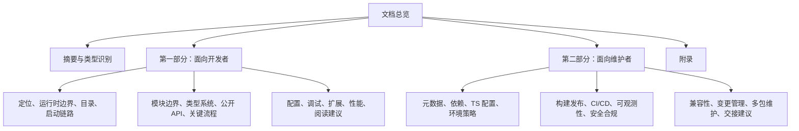
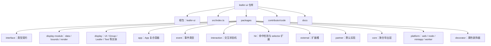
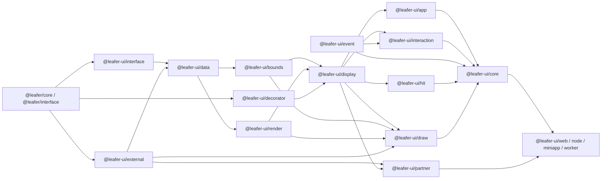
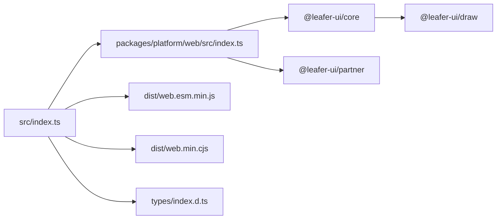
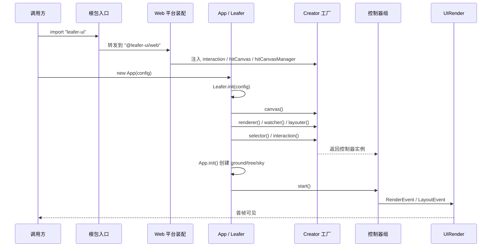
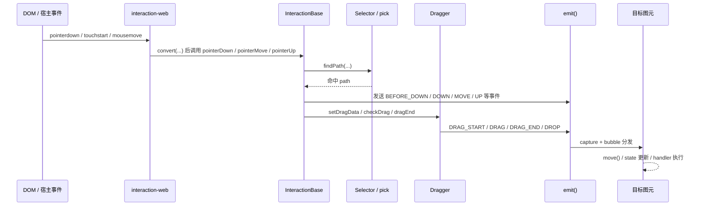
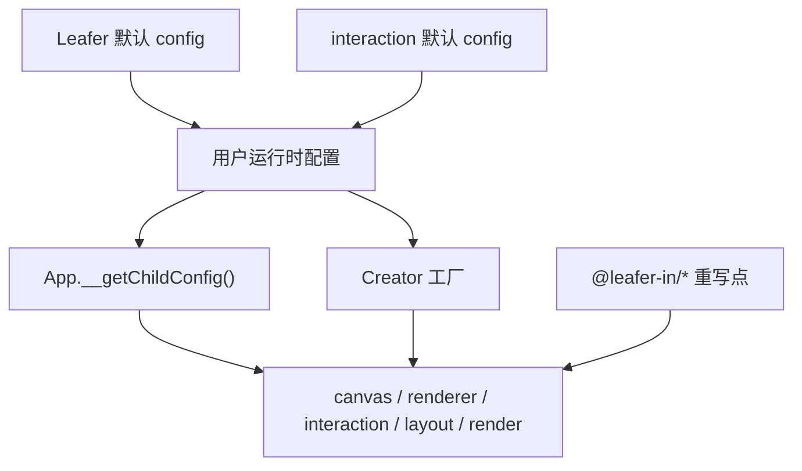
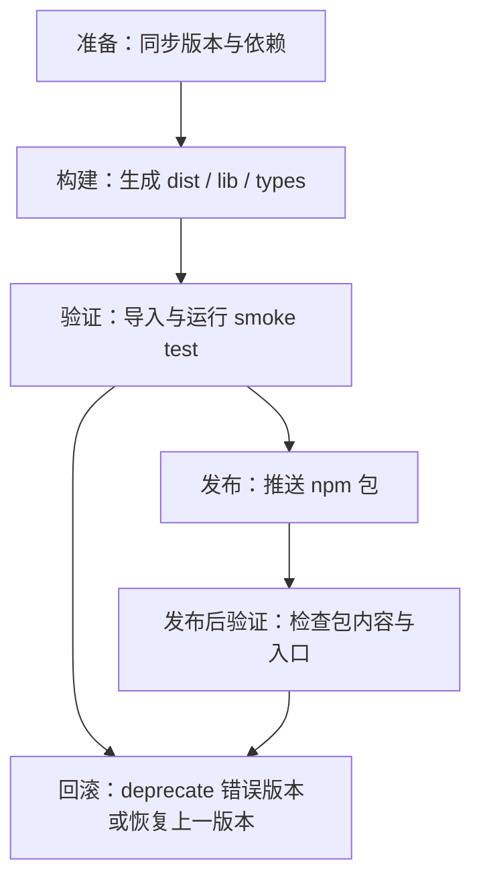

# leafer-ui 项目开发与维护文档

> 文档范围：基于当前仓库快照 `E:\Code\Node_editor\leafer-ui`  
> 输出语言：中文  
> 输出格式：Markdown  
> 文档深度：深入  
> 结论原则：仅以仓库中的源码、目录和配置为依据；无法直接确认的内容标为 `【待确认】`，基于结构关系的判断标为 `【推断】`

## 1. 一页式项目摘要

| 项 | 结论 |
| --- | --- |
| 项目名称 | `leafer-ui` |
| 项目类型 | 以 `library / sdk` 为主，仓库形态是“多包源码仓库”，但不是标准 npm workspace monorepo |
| 面向运行时 | 仓库级别是 `browser + node + miniapp + worker` 混合运行时；根包默认面向 `browser` |
| 根包入口 | `src/index.ts`，只做 `export * from '@leafer-ui/web'` |
| 根包发布面 | 根 `package.json` 暴露 `dist/web.esm.min.js`、`dist/web.min.cjs` 和 `types/index.d.ts` |
| 主要能力 | Canvas UI 图元、复合画布容器、事件分发、拖拽/缩放等交互、命中检测、多平台装配、可被插件重写的渲染/导出/状态能力 |
| 源码组织方式 | `packages/interface` 定义契约，`display-module` 和 `display` 承担核心实现，`interaction/event/hit` 提供运行时行为，`partner/external` 提供扩展槽与默认实现，`platform/*` 负责装配不同运行时 |
| 构建与测试状态 | 当前仓库未包含 `tsconfig`、锁文件、CI、测试配置、构建脚本；`dist/lib/types` 也未纳入版本库 |
| 包管理器 | `【待确认】`，未发现 lock file，也未发现 `packageManager` 字段 |
| 维护重点 | 导出链、模块装配顺序、插件重写点、平台适配器、构建/发布缺失的工程基础设施 |

一句话判断：`leafer-ui` 不是一个“可直接启动的前后端应用”，而是一套按层拆分、支持多平台装配与插件扩展的 TypeScript 图形引擎 UI/交互库；当前仓库更像“源码仓库 + 发布入口定义”，完整构建、测试和集成运行链路并不在本快照中。

## 2. 文档目录框架

1. 总览：项目摘要、目录、Mermaid 清单、项目类型识别
2. 第一部分：面向开发者
3. 第二部分：面向维护者
4. 附录：术语、源码证据、待确认项、FAQ、文档缺口



## 3. 文档 tree（最多 3 层）

```text
leafer-ui
├─ package.json
├─ src/
│  └─ index.ts
├─ packages/
│  ├─ app/
│  ├─ core/
│  ├─ decorator/
│  ├─ display/
│  ├─ display-module/
│  ├─ event/
│  ├─ external/
│  ├─ hit/
│  ├─ interaction/
│  ├─ interface/
│  ├─ partner/
│  └─ platform/
├─ contributor/
│  └─ code/
└─ docs/
   └─ leafer-ui-architecture.md
```

## 4. 需要生成的 Mermaid 图清单

1. 文档结构图
2. 项目 / 多包结构图
3. 核心模块架构图
4. 主业务链路时序图：实例创建到首帧渲染
5. 关键交互链路时序图：Pointer 事件到拖拽/分发
6. 构建 / 启动链路图
7. 配置 / 环境变量影响图
8. 导出链 / 打包产物 / 类型声明关系图
9. 发布 / 回滚流程图

## 5. 项目类型识别结果与识别依据

### 识别结果

- 主类型：`library / sdk`
- 仓库形态：多包源码仓库
- 运行时形态：`fullstack / hybrid` 风格的多运行时库，但不是全栈业务应用
- monorepo 判断：目录上是多包仓库，工程配置上不是标准 workspace monorepo

### 识别依据

1. 根包不是应用入口，而是发布入口。  
   证据：`package.json` 中 `main` 指向 `dist/web.esm.min.js`，`exports` 同时暴露 `import`、`require`、`types`；`src/index.ts` 只有 `export * from '@leafer-ui/web'`。

2. 仓库存在大量可独立发布的子包，而不是单体应用目录。  
   证据：`packages/*/**/package.json` 分布在 `app`、`display`、`interaction`、`platform` 等目录下，包名包括 `@leafer-ui/web`、`@leafer-ui/node`、`@leafer-ui/core`、`@leafer-ui/partner` 等。

3. 存在明显的平台适配层。  
   证据：`packages/platform/web/src/index.ts`、`packages/platform/node/src/index.ts`、`packages/platform/miniapp/src/index.ts`、`packages/platform/worker/src/index.ts` 都在装配 `Creator` 工厂。

4. 不存在前端页面路由或后端服务入口。  
   证据：未发现 `src/main.tsx`、`pages/`、`app/`、`server.ts`、`express`/`nest`/`next`/`vite` 配置；源码核心是图元类、事件类、渲染模块和平台装配代码。

5. 仓库没有标准 workspace 管理配置。  
   证据：未发现 `pnpm-workspace.yaml`、`turbo.json`、`nx.json`、`lerna.json`，根 `package.json` 也没有 `workspaces` 字段。

6. 完整集成运行链路可能位于仓库外部。  
   证据：当前仓库未包含 `tsconfig`、测试配置、CI、构建脚本；`README.md` 明确把“可直接运行代码”的主集成仓库指向 `LeaferJS`，自动化测试仓库指向 `test`。这部分属于 `【推断】`，但与当前快照状态一致。

---

# 第一部分：面向开发者

## 1. 项目定位、使用场景、非目标、术语

### 项目定位

`leafer-ui` 提供的是一层建立在 Leafer 基础核心之上的 UI/交互运行时。它把图元、容器、文字、图片、命中检测、事件分发、拖拽缩放、平台交互装配等能力拆成多个包，再在根包上聚合为默认的 Web 发行面。

从源码结构看，它最重要的设计目标有三类：

1. 让 UI 图元和画布容器具备一致的数据模型与渲染模型。
2. 让不同运行时通过统一 `Creator` 工厂装配同一套 UI/交互核心。
3. 让部分能力以“占位接口 + 默认实现 + 外部插件重写”的方式可扩展。

### 主要使用场景

- 浏览器中的 Canvas UI / 图形编辑 / 可视化编辑器
- Node 运行时中的离屏渲染或导出链
- 小程序和 Worker 等非标准浏览器运行时
- 需要可扩展图元、交互和渲染模块的引擎型产品

### 非目标

- 不是一个带页面路由、接口层、状态管理框架的业务前端应用
- 不是一个 HTTP 服务或后端 API 服务
- 不是完整生态仓库；`@leafer-in/*` 插件实现、自动化测试、在线文档都不在当前仓库
- 不是当前快照内可直接复现构建与发布流程的工程模板

### 关键术语表

| 术语 | 含义 | 主要落点 |
| --- | --- | --- |
| `UI` | 所有可渲染图元的基础类，承载属性、路径、绘制、动画/导出扩展点 | `packages/display/src/UI.ts` |
| `Group` / `Box` | 带子节点的容器；`Box` 在 `Group` 基础上加入自身盒模型和 overflow 逻辑 | `packages/display/src/Group.ts`、`packages/display/src/Box.ts` |
| `Leafer` | 运行时根容器，负责 canvas、renderer、watcher、layouter、interaction 等控制器装配 | `packages/display/src/Leafer.ts` |
| `App` | 多层 `Leafer` 复合容器，提供 `ground/tree/sky` 三层和编辑器入口 | `packages/app/src/App.ts` |
| `UIData` | 运行时数据层，负责属性归一化、paint/path 预处理和计算缓存 | `packages/display-module/data/src/UIData.ts` |
| `UIRender` / `UIBounds` | 渲染和边界计算模块，通过 `@useModule` 混入 `UI` | `packages/display-module/render/src/UIRender.ts`、`packages/display-module/bounds/src/UIBounds.ts` |
| `external` | 扩展槽位，占位定义 `Paint`、`Effect`、`Export`、`State` 等模块 | `packages/external/src/index.ts` |
| `partner` | 默认实现层，把 `paint/image/effect/text/color` 等实现写回 `external` 占位对象 | `packages/partner/partner/src/index.ts` |
| `@leafer-in/*` | 外部插件生态，会重写动画、状态、导出、编辑器、视口等行为 | 多处 `rewrite` / `Plugin.need()` 注释与调用 |

- 对开发者的价值：这一章先把“这个仓库到底是什么”讲清楚，可以避免按前后端应用的思路误读整个项目。
- 关键源码证据：`src/index.ts`；`packages/display/src/UI.ts`；`packages/display/src/Leafer.ts`；`packages/app/src/App.ts`；`packages/external/src/index.ts`；`packages/partner/partner/src/index.ts`
- 待确认项：官方团队如何界定“核心仓库、UI 仓库、插件仓库”的边界文档不在本快照中。

## 2. 技术栈与运行时边界

### TypeScript 在这里承担什么角色

TypeScript 在这个仓库里不是“给应用补类型”，而是工程边界本身：

- `packages/interface` 集中定义 UI、数据、模块接口和输入输出契约。
- 各实现包通过 `implements IUI / ILeafer / IInteraction` 等接口收敛行为。
- 装饰器和数据处理器把“编译期类型”和“运行时属性处理”连接起来，例如 `@dataType`、`@boundsType`、`@surfaceType`、`@dataProcessor`。

这意味着：类型系统既是 API 说明书，也是跨包协作协议。

### 运行时边界

#### Browser

- 根包 `leafer-ui` 默认进入 `@leafer-ui/web`
- Web 平台层会导出 `@leafer/web-core`、`@leafer-ui/core`、`@leafer-ui/interaction-web`、`@leafer-ui/partner`
- 并通过 `Object.assign(Creator, ...)` 注入浏览器版 `interaction / hitCanvas / hitCanvasManager`
- 最后执行 `useCanvas('canvas')`

#### Node

- `@leafer-ui/node` 导出 `@leafer/node-core`、`@leafer-ui/core`、`@leafer-ui/partner`
- 同时额外导出 `@leafer-in/export`
- 交互层只注入 `InteractionBase`，没有浏览器 DOM 监听器

#### Miniapp

- `@leafer-ui/miniapp` 使用 `@leafer/miniapp-core`
- 通过 `Leafer.prototype.receiveEvent` 把宿主事件转发给交互层
- `try { if (wx) useCanvas('miniapp', wx) } catch { }` 说明它依赖小程序宿主全局对象

#### Worker

- `@leafer-ui/worker` 使用 `@leafer/worker-core`
- 装配方式接近 Node，但会 `useCanvas('canvas')`

#### Edge / SSR / SSG

- 当前仓库中未发现针对 Edge Runtime、SSR、SSG 的专用入口或配置，判断为 `不适用`

### 核心框架与工具

| 类别 | 实际使用 | 说明 |
| --- | --- | --- |
| 基础核心 | `@leafer/core`、`@leafer/interface` | 提供 `Leaf`、`Branch`、`Creator`、事件/布局/渲染基元及基础接口 |
| UI 契约 | `@leafer-ui/interface` | UI 层所有跨包接口、模块契约和输入数据结构 |
| 数据与渲染 | `@leafer-ui/data`、`@leafer-ui/render`、`@leafer-ui/bounds` | 将属性处理、边界计算、渲染逻辑拆开 |
| 交互 | `@leafer-ui/event`、`@leafer-ui/interaction*`、`@leafer-ui/hit` | 统一事件类型、交互状态机和命中测试 |
| 可扩展能力 | `@leafer-ui/external`、`@leafer-ui/partner`、`@leafer-in/*` | 占位模块、默认实现、外部插件 |
| 构建工具 | `【待确认】` | 当前仓库未包含 `tsconfig`、`rollup/tsup/vite` 配置 |
| 测试工具 | `未体现` | 未发现 `vitest/jest/playwright/cypress` 配置 |
| 质量工具 | `未体现` | 未发现 `eslint/prettier/commitlint/lint-staged` 配置 |

### 为什么选择这套分层

以下是基于代码结构的 `【推断】`：

- 通过 `Creator` 工厂 + 平台适配包，可以让同一套 `display` / `interaction` 核心复用到多个运行时。
- 通过 `external -> partner` 的装配方式，可以让 `Paint / Effect / TextConvert / Export / State` 这种能力既有默认实现，又能被外部生态替换。
- 通过 `@useModule` 和 `dataProcessor`，复杂行为不必全部塞进继承链，而是用“类 + 模块 + 数据层”组合起来。

- 对开发者的价值：理解运行时边界后，你能迅速判断某个问题应该改平台层、UI 核心层，还是扩展插件层。
- 关键源码证据：`src/index.ts`；`packages/platform/web/src/index.ts`；`packages/platform/node/src/index.ts`；`packages/platform/miniapp/src/index.ts`；`packages/platform/worker/src/index.ts`；`packages/display/src/UI.ts`
- 待确认项：实际构建工具链、TypeScript 编译选项、目标浏览器和 Node 版本矩阵在本仓库中不可见。

## 3. package / workspace / 目录结构地图

### 仓库结构图



### 核心目录职责

| 路径 | 职责 | 备注 |
| --- | --- | --- |
| `package.json` | 根发布元数据，定义默认发布面和产物路径 | 无 `scripts`、无 `workspaces`、无 `packageManager` |
| `src/index.ts` | 根包聚合入口 | 默认导出 Web 平台包 |
| `packages/interface` | 全仓库共享 TS 契约 | 所有模块都依赖它保持协作边界 |
| `packages/display-module` | `data`、`bounds`、`render` 三类运行时模块 | 逻辑上是 UI 的内部实现层 |
| `packages/display` | 图元与容器类 | 最核心的业务实现层 |
| `packages/app` | 多层 `Leafer` 复合容器 | 编辑器型场景的重要入口 |
| `packages/event` | 事件实体与键鼠辅助类 | 交互层的基础 |
| `packages/interaction` | 交互状态机和平台事件桥接 | Web 与 Miniapp 有独立实现 |
| `packages/hit` | 命中检测、selector 注入、`pick` 扩展 | 通过副作用导入补丁原型 |
| `packages/external` | 模块扩展槽位和插件占位实现 | 某些能力默认会抛 `Plugin.need()` |
| `packages/partner` | `paint / effect / text / color / mask` 默认实现 | 把实现写回 `external` 对象 |
| `packages/platform` | 平台装配层 | `canvaskit` 当前是空壳包 |
| `packages/core` | 聚合导出层 | `draw` 更底层，`core` 更高层 |
| `contributor/code` | 示例源码与贡献模板 | 有助于快速了解使用姿势 |

### 建议优先阅读路径

1. `package.json`
2. `src/index.ts`
3. `packages/platform/web/src/index.ts`
4. `packages/core/core/src/index.ts`
5. `packages/core/draw/src/index.ts`
6. `packages/display/src/Leafer.ts`
7. `packages/display/src/UI.ts`
8. `packages/display-module/data/src/UIData.ts`
9. `packages/display-module/render/src/UIRender.ts`
10. `packages/interaction/interaction/src/Interaction.ts`
11. `packages/interaction/interaction/src/Dragger.ts`
12. `packages/external/src/index.ts` 与 `packages/partner/partner/src/index.ts`

### workspace 视角的真实情况

当前仓库在“目录形态”上像 monorepo，但根目录没有 workspace 编排信息，所以更准确的说法是：

- 这是一个按包拆分的源码仓库；
- 不是一个已经在仓库内自包含管理安装、任务编排、发布编排的标准 workspace；
- 如果维护上要把它升级为真正易维护的 monorepo，第一步应该是补齐 workspace 元数据和统一任务入口。

- 对开发者的价值：这一章给出“从哪一层开始读”和“每层负责什么”，能显著降低第一次入场的认知成本。
- 关键源码证据：根目录扫描结果；`packages/*/package.json`；`contributor/code/Checkerboard.ts`
- 待确认项：团队内部是否通过外部脚本或主集成仓库管理这些子包关系。

## 4. 入口文件、启动链路与初始化顺序

### 入口分层

| 层次 | 入口 | 作用 |
| --- | --- | --- |
| 根包入口 | `src/index.ts` | 直接转发到 `@leafer-ui/web` |
| Web 平台入口 | `packages/platform/web/src/index.ts` | 聚合 UI 能力并装配浏览器版 `Creator` |
| Node 平台入口 | `packages/platform/node/src/index.ts` | 聚合 UI 能力并装配 Node 版 `Creator`，额外导出 `@leafer-in/export` |
| Miniapp 平台入口 | `packages/platform/miniapp/src/index.ts` | 装配小程序版 canvas 与事件转发 |
| Worker 平台入口 | `packages/platform/worker/src/index.ts` | 装配 worker 版 canvas 工厂 |
| UI 根运行时 | `packages/display/src/Leafer.ts` | 实例初始化、控制器装配、生命周期管理 |
| 复合应用运行时 | `packages/app/src/App.ts` | 为 `Leafer` 增加 `ground/tree/sky/editor` 逻辑 |

### 启动链路图

```mermaid
flowchart LR
    importRoot["调用方 import 'leafer-ui'"]
    rootEntry["src/index.ts"]
    webEntry["packages/platform/web/src/index.ts"]
    creator["Object.assign(Creator, web factories)"]
    canvas["useCanvas('canvas')"]
    ctor["new Leafer(...) / new App(...)"]
    init["Leafer.init()"]
    controllers["canvas + renderer + watcher + layouter + selector + interaction"]
    start["start()"]
    render["首帧 render / viewReady"]

    importRoot --> rootEntry
    rootEntry --> webEntry
    webEntry --> creator
    creator --> canvas
    canvas --> ctor
    ctor --> init
    init --> controllers
    controllers --> start
    start --> render
```



### 初始化顺序

#### 1. 导入阶段

- 根包只做转发：`src/index.ts`
- Web 平台入口会：
  - 导出接口与核心能力
  - 将 `Interaction`、`LeaferCanvas`、`HitCanvasManager` 注入到 `Creator`
  - 执行 `useCanvas('canvas')`

#### 2. 实例构造阶段

- `new Leafer(userConfig)` 时，如果 `userConfig` 带 `view` 或 `width`，构造函数会直接调用 `init(userConfig)`
- `new App(userConfig)` 先走 `Leafer` 构造，再在 `App.init()` 中处理 `ground/tree/sky/editor`

#### 3. `Leafer.init()` 内部装配阶段

`packages/display/src/Leafer.ts` 的关键顺序：

1. `this.__setLeafer(this)`
2. 如果有父 `App`，先绑定共享的 selector / interaction / canvasManager
3. 合并 `userConfig` 到 `this.config`
4. 通过 `Creator.canvas / renderer / watcher / layouter` 创建控制器
5. 如果是根级 `Leafer`，再创建 `selector / interaction / hitCanvasManager / canvasManager`
6. 设置 `hittable`、`fill`，将 canvas 加入 manager
7. 监听生命周期事件
8. 若 `config.start` 为真，异步调用 `start()`

#### 4. `App.init()` 的复合逻辑

`packages/app/src/App.ts` 会在 `super.init()` 之后：

- 根据配置创建 `ground`、`tree`、`sky` 三个子 `Leafer`
- 如果有 `editor` 配置，则调用 `Creator.editor(editor, this)`
- 在 `__setApp()` 中关闭自身 watcher / layouter，把渲染和布局控制权下沉到子层

### 配置如何加载

- `Leafer.config` 有默认值：`start: true`、`hittable: true`、`smooth: true`、`lazySpeard: 100`
- `Leafer.init()` 使用 `DataHelper.assign(config, userConfig)` 合并用户配置
- `InteractionBase` 用 `DataHelper.clone(config)` 复制默认交互配置，再用 `DataHelper.default(userConfig, this.config)` 合并
- `App.__getChildConfig()` 会把父级配置裁剪后下发给子 `Leafer`

### 注册机制如何完成

- UI 类型注册：`@registerUI()`
- 数据处理器挂载：`@dataProcessor(...)`
- 模块混入：`@useModule(...)`
- 平台工厂挂载：`Object.assign(Creator, {...})`
- 扩展模块注入：`Object.assign(Paint, PaintModule)` 等

- 对开发者的价值：这一章是“从 import 到首帧”的地图，适合定位初始化时序问题、配置不生效问题和平台适配问题。
- 关键源码证据：`src/index.ts`；`packages/platform/web/src/index.ts`；`packages/display/src/Leafer.ts`；`packages/app/src/App.ts`；`packages/interaction/interaction/src/config.ts`
- 待确认项：构建期如何生成 `dist/lib/types` 产物，以及平台入口的最终打包顺序。

## 5. 模块分层与职责边界

### 核心模块架构图



### 分层说明

| 模块 | 模块职责 | 核心文件 | 关键导出 | 依赖关系 | 扩展点 | 风险点 | 建议阅读顺序 |
| --- | --- | --- | --- | --- | --- | --- | --- |
| `interface` | 所有 UI、数据、模块、事件相关契约 | `packages/interface/src/index.ts`、`IUI.ts` | `IUI`、`ILeafer`、`IApp`、`IUIRenderModule`、`IExportModule` | 依赖 `@leafer/interface`，被几乎所有包消费 | 新增接口、公共类型、模块契约 | 改动会影响全仓库及外部插件 | 1 |
| `decorator` | 补充 UI 层属性装饰器 | `packages/decorator/src/index.ts` | `effectType`、`zoomLayerType` 等 | 被 `display` 使用 | 新属性处理器 | 装饰器语义与运行时数据层耦合 | 2 |
| `display-module` | 数据预处理、边界计算、渲染模块 | `UIData.ts`、`UIBounds.ts`、`UIRender.ts` | `UIData`、`RectData`、`TextData`、`UIBounds`、`UIRender` | 依赖 `interface`、`external` | 可新增 data/render/bounds 模块 | 运行时缓存和计算逻辑复杂 | 3 |
| `display` | 图元类与容器类实现 | `UI.ts`、`Group.ts`、`Box.ts`、`Leafer.ts`、`Text.ts` | `UI`、`Leafer`、`Rect`、`Text` 等 | 依赖 `display-module`、`external`、`decorator` | 新图元、重写类方法 | 类上有大量 `__` 内部协议与插件重写点 | 4 |
| `app` | 多层应用容器 | `App.ts` | `App` | 依赖 `display`、`data` | 三层画布、编辑器入口 | 共享 canvas/interaction 的时序较隐式 | 5 |
| `event` | UI 事件模型 | `index.ts`、`PointerEvent.ts`、`DragEvent.ts` | `PointerEvent`、`DragEvent`、`Keyboard` 等 | 被 `interaction` 消费 | 自定义事件类型 | 事件阶段、按钮语义必须与交互层一致 | 6 |
| `interaction` | 交互状态机与平台桥接 | `Interaction.ts`、`Dragger.ts`、`interaction-web/src/Interaction.ts` | `InteractionBase`、`Interaction`、`Dragger` | 依赖 `display`、`event` | 新平台事件桥接、手势重写 | 复杂状态转移、平台差异大 | 7 |
| `hit` | 命中检测与 selector 注入 | `index.ts`、`pick.ts`、`HitCanvasManager.ts` | `HitCanvasManager` | 依赖 `draw`；通过副作用修改原型 | 自定义命中策略 | 依赖导入顺序，副作用不直观 | 8 |
| `external` | 占位扩展模块 | `packages/external/src/index.ts` | `Paint`、`Effect`、`Export`、`State`、`Transition` | 被 `display` / `partner` 使用 | 完整扩展面 | 默认行为可能是 `Plugin.need()` | 9 |
| `partner` | 默认实现层 | `packages/partner/partner/src/index.ts` | `@leafer-ui/partner` 聚合包 | 依赖 `draw` + 各 partner 子包 | 替换默认实现 | `Object.assign` 写回顺序依赖强 | 10 |
| `platform/*` | 平台装配层 | `web/src/index.ts`、`node/src/index.ts` 等 | `@leafer-ui/web` 等 | 依赖 `core`、`partner` | 新 runtime 适配器 | 全局工厂注入、宿主 API 差异 | 11 |
| `core/*` | 聚合导出层 | `packages/core/draw/src/index.ts`、`packages/core/core/src/index.ts` | `@leafer-ui/draw`、`@leafer-ui/core` | 上承实现层，下接平台层 | 调整对外公开面 | 变更影响所有高层包 | 12 |

### 这个仓库最关键的边界不是“文件夹”，而是三种装配关系

1. 类型契约边界：`interface`
2. 运行时实现边界：`data/bounds/render/display/interaction/hit`
3. 平台与扩展装配边界：`external/partner/platform/@leafer-in`

如果你要新增能力，先判断它属于哪一类装配关系，再决定改哪层。

- 对开发者的价值：这一章解释了每一层“该做什么、不该做什么”，是扩展新功能时最重要的边界说明。
- 关键源码证据：`packages/interface/src/index.ts`；`packages/display-module/data/src/UIData.ts`；`packages/display/src/UI.ts`；`packages/app/src/App.ts`；`packages/interaction/interaction/src/Interaction.ts`；`packages/external/src/index.ts`；`packages/partner/partner/src/index.ts`
- 待确认项：外部插件 `@leafer-in/*` 对这些边界的正式约束文档不在当前仓库中。

## 6. 类型系统与核心契约

### 核心契约分布

| 契约类别 | 主要文件 | 说明 |
| --- | --- | --- |
| 运行时根对象 | `packages/interface/src/app/ILeafer.ts`、`IApp.ts` | 定义 `Leafer` / `App` 的公开能力与层级关系 |
| UI 实体 | `packages/interface/src/IUI.ts` | 定义 `Rect`、`Text`、`Image`、`Group`、`Box` 等图元与输入数据 |
| 模块契约 | `packages/interface/src/module/*.ts` | 定义 `IUIRenderModule`、`IUIBoundsModule`、`IExportModule`、`IPaintModule` 等 |
| 计算与字符串类型 | `packages/interface/src/type/*.ts` | 定义颜色、描边、路径、文本等共享类型 |
| 动画与编辑器 | `IAnimation.ts`、`editor/IEditor.ts` | 为外部插件或附加能力预留契约 |

### 类型在边界上的作用

#### 1. 对外 API 边界

- `ILeafer`、`IApp`、`IUI` 是使用者最直接接触的对象契约。
- `IUIInputData`、`IRectInputData`、`ITextInputData` 等定义“创建图元时允许传什么”。

#### 2. 内部模块协作边界

- `IUIData`、`ITextData` 等连接类实例与数据处理器
- `IUIRenderModule` / `IUIBoundsModule` 让模块可按 `ThisType<IUI>` 的方式混入 UI 类

#### 3. 扩展插件边界

- `IPaintModule`、`IEffectModule`、`IExportModule`、`IStateModule` 等定义了可替换模块应实现的最小面
- `external` 包拿这些接口作为占位对象的类型外壳

### 编译期校验与运行时校验如何分工

这套工程没有看到 `zod`、`io-ts`、`class-validator`、`yup`、`ajv` 之类的 schema 工具。

它的分工方式更接近：

- 编译期：由 `interface / type / enum / union` 做类型约束
- 运行时：由 `@dataType`、`@boundsType`、`@surfaceType`、`@dataProcessor`、`UIData.setPath()`、`TextData.setFontWeight()` 等处理器做归一化和容错

例如：

- `TextData.setFontWeight()` 会把字符串权重转成数值权重
- `UIData.setPath()` 会把路径字符串或对象数组转换成 canvas path data
- `UIData.__setPaint()` 会把 fill/stroke 标记为需要后续计算的 paint

### 跨模块共享契约

最值得关注的共享契约有：

- `ILeafer` / `IApp`
- `IUI` / `IGroup` / `IBox`
- `IUIInputData` 与各图元 `*InputData`
- `IUIRenderModule` / `IUIBoundsModule`
- `IPaintModule` / `IEffectModule` / `IExportModule` / `IStateModule`

这些类型既被内部实现依赖，也被外部生态依赖，是 breaking change 的高风险区域。

- 对开发者的价值：理解契约层能帮助你在“我要改实现”与“我要改公共 API”之间做出正确判断。
- 关键源码证据：`packages/interface/src/index.ts`；`packages/interface/src/IUI.ts`；`packages/interface/src/module/IUIRender.ts`；`packages/interface/src/module/IUIBounds.ts`；`packages/interface/src/module/IExport.ts`；`packages/display-module/data/src/UIData.ts`；`packages/display-module/data/src/TextData.ts`
- 待确认项：装饰器编译参数、声明文件生成策略和 API 稳定性承诺不在当前仓库中。

## 7. API / 导出入口 / 事件 / 命令说明

### 导出链与产物关系图



### 主要公开使用面

| 使用面 | 入口 | 输入 | 输出 | 约束 / 错误场景 | 关键依赖 |
| --- | --- | --- | --- | --- | --- |
| 默认 Web 库 | `leafer-ui` | import 语句 | Web 平台的完整 UI 能力 | 依赖浏览器 canvas 与 Web 交互装配 | `src/index.ts` -> `@leafer-ui/web` |
| 平台专用入口 | `@leafer-ui/web` / `node` / `miniapp` / `worker` | import 语句 | 对应 runtime 的 UI 能力 | 需要对应宿主核心包；`miniapp` 依赖宿主事件转发 | `packages/platform/*/src/index.ts` |
| 根容器 | `new Leafer(config)` | `ILeaferConfig` | 根画布容器实例 | 无 `view` / `width` 时不会在构造阶段自动 `init()` | `packages/display/src/Leafer.ts` |
| 复合容器 | `new App(config)` | `IAppConfig` | 带 `ground/tree/sky` 的应用容器 | 编辑器相关能力依赖外部 `Creator.editor` / 插件 | `packages/app/src/App.ts` |
| 图元创建 | `Rect.one(data, x, y, width, height)` 等 | `IUIInputData` 及派生类型 | 已注册 UI 实例 | `data.tag` 或原型 `__tag` 必须能被 `UICreator` 识别 | `packages/display/src/UI.ts` |
| 容器操作 | `Group.add/remove/clear`、`App.addLeafer` | UI 实例或输入数据 | 修改场景树 | 真实分支行为有 `@leafer/core` 的 `Branch` 模块参与 | `packages/display/src/Group.ts`、`packages/app/src/App.ts` |
| 导出能力 | `ui.export()` / `ui.syncExport()` | 文件名与导出配置 | Promise 或同步导出结果 | 未装配导出插件时会走 `Plugin.need('export')` | `packages/display/src/UI.ts`、`packages/external/src/index.ts` |
| 动画与状态 | `ui.animate()`、`State.set()` | 动画配置 / 状态名 | 动画控制句柄或状态更新 | 当前仓库默认未实现完整能力，可能要求外部插件 | `packages/display/src/UI.ts`、`packages/external/src/index.ts` |
| 命中查询 | `group.pick(point)`、`ui.find()` | 坐标或条件 | 命中结果或节点列表 | `find()` 默认会 `Plugin.need('find')`；`pick()` 依赖 `hit` 包副作用补丁 | `packages/hit/src/pick.ts`、`packages/display/src/UI.ts` |
| 事件系统 | `on(PointerEvent.*)` 等 | 事件名与处理器 | 捕获/冒泡事件 | 事件分发依赖 selector 与 interaction 正常装配 | `packages/event/src/index.ts`、`packages/interaction/interaction/src/emit.ts` |

### 事件面

当前仓库明确体现的事件分组：

- Pointer：`DOWN / MOVE / UP / TAP / CLICK / DOUBLE_TAP / MENU / LONG_PRESS ...`
- Drag：`START / DRAG / END / OVER / OUT / ENTER / LEAVE`
- Drop：`DROP`
- Move：拖动视图时的 `MoveEvent`
- Rotate / Zoom / Swipe / Key

### 一个最小可工作的使用范式

```ts
import { App, Rect } from 'leafer-ui'

const app = new App({ view: window, ground: {}, tree: {}, sky: {} })

app.tree.add(
  Rect.one({ fill: '#FEB027', editable: true }, 100, 100, 200, 120)
)
```

这个例子与源码结构是一致的：

- 根包默认走 Web 平台入口
- `App` 自动创建多层子 `Leafer`
- 图元通过 `Class.one()` 走注册表创建
- `editable` 这类能力最终是否完整生效，取决于外部插件是否已装配

### 鉴权或访问控制

不适用。当前仓库是运行时库，不含用户身份、权限校验、HTTP 访问控制等逻辑。

- 对开发者的价值：这一章回答“外部能用什么、输入输出是什么、哪些 API 其实依赖插件”的问题。
- 关键源码证据：`package.json`；`src/index.ts`；`packages/platform/web/src/index.ts`；`packages/display/src/UI.ts`；`packages/display/src/Leafer.ts`；`packages/app/src/App.ts`；`packages/hit/src/pick.ts`；`packages/event/src/index.ts`
- 待确认项：各平台包的正式发布矩阵、示例工程和公共 API 稳定级别未在本仓库定义。

## 8. 关键运行时流程

### 流程一：实例创建到首帧渲染



代码落点说明：

1. 根包转发：`src/index.ts`
2. Web 平台装配：`packages/platform/web/src/index.ts`
3. 运行时初始化：`packages/display/src/Leafer.ts::init`
4. 复合层创建：`packages/app/src/App.ts::init`
5. 生命周期监听：`packages/display/src/Leafer.ts::__listenEvents`
6. 具体渲染：`packages/display-module/render/src/UIRender.ts::__draw`

### 流程二：Pointer 事件到拖拽与事件分发



代码落点说明：

1. 平台桥接：`packages/interaction/interaction-web/src/Interaction.ts`
2. 通用交互状态机：`packages/interaction/interaction/src/Interaction.ts`
3. 命中与 path 解析：`InteractionBase.findPath()`，`packages/hit/src/pick.ts`
4. 拖拽逻辑：`packages/interaction/interaction/src/Dragger.ts`
5. 捕获/冒泡分发：`packages/interaction/interaction/src/emit.ts`

### 流程三：扩展模块从占位到默认实现

这个流程不是用户事件链，而是插件机制的核心：

1. `packages/external/src/index.ts` 先声明 `Paint / Effect / TextConvert / Export / State / Transition` 等占位对象
2. `packages/partner/partner/src/index.ts` 引入默认实现模块
3. 通过 `Object.assign(...)` 把实现写回占位对象
4. `display` 和 `display-module` 中的 `UIRender / UIData / Text` 等实现始终只依赖 `external` 提供的抽象面

这让同一份 UI 实现既能使用默认实现，也能被外部生态替换。

- 对开发者的价值：这一章把最关键的两条运行时链路讲明白，遇到“为什么事件没发出来”“为什么首帧不出现”“为什么某个扩展能力不生效”时，可以直接回到这些步骤排查。
- 关键源码证据：`packages/platform/web/src/Interaction.ts`；`packages/interaction/interaction/src/Interaction.ts`；`packages/interaction/interaction/src/Dragger.ts`；`packages/interaction/interaction/src/emit.ts`；`packages/external/src/index.ts`；`packages/partner/partner/src/index.ts`
- 待确认项：Selector 的完整实现来自 `@leafer/core`，当前仓库只看到注入与调用，没有看到完整 selector 内核。

## 9. 配置、环境变量、feature flags 与路径别名

### 配置来源

当前仓库没有 `.env`、`config/`、`src/config/`、`tsconfig paths` 这类传统配置层。真正的配置来源主要有三类：

1. `Leafer` / `App` 构造入参
2. `Interaction` 默认配置对象
3. 外部插件与平台装配的副作用逻辑

### 配置影响图



### 关键配置项

#### `Leafer.config`

默认值位于 `packages/display/src/Leafer.ts`：

- `start: true`
- `hittable: true`
- `smooth: true`
- `lazySpeard: 100`

高风险配置项：

- `view` / `width` / `height`：影响是否自动初始化与 auto layout
- `fill`：会影响 canvas 背景色或触发重绘
- `hittable`：直接影响根 canvas 命中
- `mode`：变更时会发 `LeaferEvent.UPDATE_MODE`

#### `Interaction` 默认配置

位于 `packages/interaction/interaction/src/config.ts`：

- `pointer.hitRadius = 5`
- `pointer.tapTime = 120`
- `pointer.longPressTime = 800`
- `pointer.dragDistance = 2`
- `wheel.zoomSpeed / moveSpeed / rotateSpeed = 0.5`
- `touch.preventDefault = 'auto'`

这些配置直接影响交互体验和命中灵敏度。

### feature flags 与条件逻辑

这个仓库没有集中式 feature flag 系统，但有三种“事实上的 feature switch”：

1. 布尔或枚举属性：例如 `hittable`、`draggable`、`editable`、`overflow`
2. 平台装配差异：Web / Node / Miniapp / Worker
3. 插件可用性：`Plugin.need('find')`、`Plugin.need('export')`、`Plugin.need('state')`

### 路径别名

`tsconfig paths` 未发现；当前源码依赖 npm 包名级别的导入，而不是本地 alias。

这意味着：

- 构建时如何把这些包名解析回源码目录属于 `【待确认】`
- 当前仓库快照无法证明是否依赖外部 workspace / bundler alias / package manager link 机制

### 配置优先级与覆盖顺序

1. `Leafer` / `Interaction` 默认配置
2. 用户传入配置
3. `App.__getChildConfig()` 派生子配置
4. 外部插件对方法或字段的重写

- 对开发者的价值：这一章能帮助你判断“配置为什么没生效”，尤其是父子 `Leafer`、平台装配和插件重写之间的优先级。
- 关键源码证据：`packages/display/src/Leafer.ts`；`packages/app/src/App.ts`；`packages/interaction/interaction/src/config.ts`；`packages/display/src/UI.ts`
- 待确认项：是否存在未提交到当前仓库的额外配置文件、alias 配置或打包解析规则。

## 10. 构建、测试、调试、排错

### 如何安装依赖

当前仓库未包含 lock file 和 `packageManager` 字段，因此：

- 官方团队实际使用 `pnpm / npm / yarn / bun` 中哪一个是 `【待确认】`
- `【推断】` 使用任一兼容 npm 生态的包管理器都可以解析依赖，但未必能复现官方发布流程

### 如何本地运行

当前仓库本身不具备“直接运行一个应用”的完整条件，原因是：

- 没有 demo app 入口
- 没有 bundler 配置
- 没有 tsconfig
- 没有脚本

可见的可运行线索只有：

- `contributor/code/Checkerboard.ts` 这样的示例代码
- `README.md` 指向外部主集成仓库 `LeaferJS`

因此更准确的结论是：

- 当前仓库适合阅读源码、改库、补实现
- 真正的运行与联调环境大概率在外部仓库或内部未提交脚本中，这是 `【推断】`

### 构建产物

从 `package.json` 可以确认预期产物，但不能确认生成方式：

| 包 | 预期产物 |
| --- | --- |
| 根包 `leafer-ui` | `dist/web.esm.min.js`、`dist/web.min.cjs`、`types/index.d.ts` |
| `@leafer-ui/core` | `lib/core.esm.min.js`、`types/index.d.ts` |
| `@leafer-ui/draw` | `lib/draw.esm.min.js`、`types/index.d.ts` |
| `@leafer-ui/miniapp` | `dist/miniapp.esm.min.js`、`types/index.d.ts` |
| `@leafer-ui/node` | `dist/node.esm.min.js`、`types/index.d.ts` |
| `@leafer-ui/worker` | `dist/worker.esm.min.js`、`types/index.d.ts` |

当前仓库中 `dist/lib/types` 目录并不存在，且 `.gitignore` 明确忽略这些目录。

### 测试状态

- 未发现单元测试
- 未发现集成测试
- 未发现 E2E 配置
- 未发现 CI 工作流

### 调试建议

遇到问题时建议的断点路径：

1. 初始化异常：`packages/display/src/Leafer.ts::init`
2. 首帧不出来：`packages/display/src/Leafer.ts::__listenEvents`、`packages/display-module/render/src/UIRender.ts::__draw`
3. 图元属性不对：`packages/display-module/data/src/UIData.ts`
4. 文本布局不对：`packages/display/src/Text.ts::__updateTextDrawData`、`packages/display-module/data/src/TextData.ts`
5. 拖拽或点击异常：`packages/interaction/interaction-web/src/Interaction.ts`、`packages/interaction/interaction/src/Interaction.ts`、`Dragger.ts`
6. 插件能力缺失：`packages/external/src/index.ts` 中的 `Plugin.need(...)`

### 常见报错与定位建议

| 现象 | 优先检查 |
| --- | --- |
| `find` / `export` / `animate` 不工作 | 是否命中了 `Plugin.need('find' / 'export' / 'animate')` |
| `new Leafer()` 后无画面 | 是否传入了 `view` 或显式调用 `init()` |
| 浏览器交互不触发 | 是否走了 Web 平台入口；`interaction-web` 是否被装配 |
| `pick()` 不存在或结果异常 | 是否导入了包含 `@leafer-ui/hit` 的高层包；`hit/index.ts` 的副作用是否生效 |
| 小程序事件不工作 | 是否通过 `Leafer.receiveEvent()` 转发宿主事件 |

- 对开发者的价值：这章明确告诉你“这个仓库现在能做什么、不能做什么”，以及调试时该从哪几个文件下手。
- 关键源码证据：`package.json`；`.gitignore`；`packages/display/src/Leafer.ts`；`packages/external/src/index.ts`；`contributor/code/Checkerboard.ts`；`README.md`
- 待确认项：官方本地开发命令、正式测试方案和构建入口不在当前仓库。

## 11. 二次开发与扩展点

### 可扩展点

1. 新 UI 类型  
   方式：新增类，使用 `@registerUI()` 和 `@dataProcessor(...)`，必要时通过 `@useModule(...)` 挂载渲染/边界模块。

2. 新运行时模块  
   方式：实现 `IUIRenderModule`、`IUIBoundsModule`、`IPaintModule`、`IEffectModule` 等接口，再通过 `Object.assign(...)` 或 `@useModule(...)` 接入。

3. 新平台适配器  
   方式：新增 `packages/platform/<runtime>/src/index.ts`，按 Web/Node 模式为 `Creator` 注入 `interaction / hitCanvas / hitCanvasManager`。

4. 外部插件重写  
   方式：沿用 `@leafer-in/*` 生态，通过 `rewrite`、方法替换或占位对象写回扩展现有能力。

5. 示例与集成验证  
   方式：在 `contributor/code` 或外部集成仓库中增加最小复现示例。

### 不建议依赖的内部细节

- `__` 开头的内部数据对象，例如 `this.__`、`__pathForRender`、`__useEffect`
- 依赖导入顺序才能成立的副作用补丁
- `Plugin.need()` 占位行为的具体错误表现
- 未在 `interface` 包中稳定定义的内部实现字段

### 目前最值得利用的扩展机制

| 扩展机制 | 适用场景 |
| --- | --- |
| `@registerUI()` | 新图元类型 |
| `@useModule()` | 混入新渲染或边界逻辑 |
| `Object.assign(external, module)` | 替换默认实现 |
| `Creator` 工厂装配 | 新平台适配 |
| 外部插件重写 | 编辑器、导出、视口、状态、动画等增强能力 |

- 对开发者的价值：这章直接回答“我该怎样安全扩展它”，以及哪些内部字段最好不要耦合。
- 关键源码证据：`packages/display/src/UI.ts`；`packages/display/src/Rect.ts`；`packages/platform/web/src/index.ts`；`packages/external/src/index.ts`；`packages/partner/partner/src/index.ts`；`packages/display/src/Box.ts`
- 待确认项：官方推荐的插件扩展规范和版本兼容策略在当前仓库中不可见。

## 12. 性能、包体积、构建效率与质量

### 运行时性能线索

从源码中能确认的性能设计包括：

1. `UIRender.__draw()` 区分复杂路径和快速路径  
   复杂情形才进入阴影、filter、多 paint、多 stroke 的完整流程。

2. `UIData.__needComputePaint` 延迟计算 paint  
   图片或复杂 paint 可按需计算。

3. `HitCanvasManager` 做命中画布缓存  
   `maxTotal = 1000`，超过后自动清理。

4. `Leafer.config.lazySpeard` 与 `updateLazyBounds()`  
   用于控制延迟边界与更新范围。

5. 文本布局单独预计算  
   `Text.__updateTextDrawData()` 会先生成 `__textDrawData`

### 包体积与 tree-shaking

- 根包是高层聚合包，默认导向 Web 全量能力
- 代码中大量存在副作用导入，例如：
  - `packages/hit/src/index.ts`
  - `packages/partner/mask/src/index.ts`
  - `packages/partner/partner/src/index.ts`
- 根 `package.json` 未声明 `sideEffects`

因此可以得到两个结论：

- 想要最小引入面时，优先评估是否直接消费更细粒度子包，而不是总是走根包
- 若后续要追求极致 tree-shaking，需要非常谨慎地处理这些副作用模块和 `sideEffects` 元数据

### 构建效率与工程质量

当前快照里最明显的短板不是运行时，而是工程侧：

- 无 `tsconfig`
- 无测试
- 无 lint
- 无 CI
- 无构建脚本

这会直接影响构建效率的可复现性和代码质量的可验证性。

- 对开发者的价值：这一章能帮你区分“引擎本身已经做了哪些性能优化”和“工程侧还缺什么保障”。
- 关键源码证据：`packages/display-module/render/src/UIRender.ts`；`packages/display-module/data/src/UIData.ts`；`packages/hit/src/HitCanvasManager.ts`；`package.json`；`packages/hit/src/index.ts`；`packages/partner/partner/src/index.ts`
- 待确认项：真实发布包的体积、benchmark、sourcemap 和构建耗时数据不在当前仓库。

## 13. 已知问题、技术债与源码阅读建议

### 当前明显技术债

1. 工程配置缺失：`tsconfig`、build、test、CI 都不在当前仓库
2. 多包仓库缺少 workspace 元数据
3. 插件重写点很多，但“哪些能力来自哪个插件”没有集中清单
4. 副作用补丁较多，导入顺序与装配顺序需要靠阅读源码理解
5. `@leafer-ui/canvaskit` 当前为空包，维护语义不清晰

### 易踩坑位置

- 误把根包当成完整 demo 工程使用
- 直接依赖 `__` 内部字段
- 在未导入高层包时调用 `pick()` 或其他依赖副作用的能力
- 忽略 `Plugin.need()` 导致把“缺插件”误判为“代码坏了”
- 修改 `interface` 契约却没有全局联动检查

### 新开发者第一周阅读顺序

1. `package.json`
2. `src/index.ts`
3. `packages/platform/web/src/index.ts`
4. `packages/core/core/src/index.ts`
5. `packages/display/src/Leafer.ts`
6. `packages/display/src/UI.ts`
7. `packages/display-module/data/src/UIData.ts`
8. `packages/display-module/render/src/UIRender.ts`
9. `packages/interaction/interaction/src/Interaction.ts`
10. `packages/external/src/index.ts` 与 `packages/partner/partner/src/index.ts`

### 最应该补齐的文档缺口

- 平台适配器设计文档
- 插件重写点总表
- 构建/发布说明
- 版本兼容策略
- 外部仓库与当前仓库的职责分工

- 对开发者的价值：这一章把阅读成本最高、最容易踩坑的地方提前说透，适合作为 onboarding 清单。
- 关键源码证据：`packages/platform/canvaskit/src/index.ts`；`packages/external/src/index.ts`；`packages/hit/src/index.ts`；`README.md`
- 待确认项：哪些技术债已经由外部主集成仓库补偿，当前快照无法确认。

---

# 第二部分：面向维护者

## 1. package 元数据与工程基础设施

### 根包元数据评价

优点：

- 根包 `name/version/license/type/main/exports/types/files` 都已定义
- 仓库与 issue 链接完整
- 发布面明确指向 ESM / CJS / types

问题：

- 没有 `scripts`
- 没有 `packageManager`
- 没有 `engines`
- 没有 `private`
- 没有 `workspaces`

这说明它更像“发布描述文件”，而不是完整工程控制面。

### 文档与许可证

- `README.md` 存在
- 根 `LICENSE` 存在
- 各子包也各自带 `LICENSE`
- 未发现 `CHANGELOG`

### 目录组织是否利于长期维护

源码层的组织是清晰的，但工程基础设施层并不完整。换句话说：

- 代码分层适合长期维护
- 工程编排不适合长期维护

- 对维护者的价值：这一章能帮助你判断“现在缺的是代码重构，还是工程补全”，答案明显更偏后者。
- 关键源码证据：`package.json`；根目录扫描结果；`LICENSE`；`README.md`
- 待确认项：是否存在未纳入当前仓库的内部发布脚本或 CI 模板。

## 2. 依赖管理与版本策略

### 当前策略

- 内部依赖和 `@leafer/*` 依赖几乎全部精确锁定到 `2.0.5`
- 未发现 `peerDependencies`
- 未发现 `optionalDependencies`
- 未发现 lock file

### 这带来的影响

正面：

- 版本一致性很高，能降低多包间 API 偏差

负面：

- 缺少 lock file，安装可复现性不足
- 缺少 peer/optional 分层，平台或插件依赖关系表达不够细
- 多个 `package.json` 同时手工维护版本，容易出现漏改

### 升级风险最高的依赖

| 依赖 | 风险原因 |
| --- | --- |
| `@leafer/core` | `Leaf`、`Branch`、`Creator`、事件与布局基础都在这里，牵一发动全身 |
| `@leafer/interface` | 基础接口变化会波及 `@leafer-ui/interface` 与所有实现层 |
| `@leafer/web-core` / `node-core` / `miniapp-core` / `worker-core` | 平台工厂与 canvas 适配 API 必须保持兼容 |
| `@leafer-in/*` | 插件通过重写或占位扩展接入，契约不稳时风险高 |

### 版本漂移风险

当前包版本同步得很好，但这是“结果”，不是“机制”。仓库中没有看到自动化版本同步工具，因此长期来看属于人工一致性风险。

- 对维护者的价值：这一章能帮助你识别哪些依赖一旦升级最容易引发系统性回归。
- 关键源码证据：根与子包 `package.json`；内部依赖矩阵扫描结果
- 待确认项：真实发布时是否使用 changesets、release scripts 或外部仓库脚本做版本同步。

## 3. TypeScript 工程配置策略

### 当前可见状态

当前仓库未发现任何 `tsconfig*.json`。

这带来三个直接问题：

1. 看不到 `module / target / moduleResolution / declaration / sourceMap`
2. 看不到是否启用了装饰器编译选项
3. 看不到 build tsconfig 与 dev tsconfig 是否分离

### 从现有元数据能推断出的信息

- 根包 `"type": "module"`，说明源码和发布倾向 ESM
- 但 `exports` 同时提供 `import` 与 `require`，说明最终产物支持双格式
- 多个包的 `types` 都指向 `types/index.d.ts`，说明声明文件应是统一产物

以上都说明 TypeScript 构建是重要环节，但具体策略不在仓库中。

### 隐含编译陷阱

- 大量使用装饰器，若编译器选项不一致会直接破坏行为
- 包名级导入较多，没有路径映射说明时，本地源码解析策略不透明
- 部分包 `main` 指向 `src/index.ts`，部分指向 `lib/*.esm.min.js` 或 `dist/*.esm.min.js`，发布前后的解析语义可能不同

- 对维护者的价值：这一章说明了为什么“补齐 tsconfig”不是锦上添花，而是当前仓库最关键的工程修复项之一。
- 关键源码证据：`package.json`；所有 `package.json` 中的 `main/types` 字段；源码中的装饰器用法
- 待确认项：正式编译选项、类型检查范围和 sourcemap 策略。

## 4. 环境配置、密钥与敏感项

### 环境变量清单

当前仓库未发现：

- `.env`
- `.env.example`
- `config/*`
- 密钥、token、证书注入逻辑

这符合“纯运行时库”的特征。

### 真正的配置注入方式

- 通过构造参数注入 `ILeaferConfig` / `IAppConfig`
- 通过平台包在加载时注册 `Creator`
- 通过外部插件重写默认能力

### 哪些配置变更风险较高

- 平台入口中的 `Creator` 注入逻辑
- `Leafer.config` 的根级默认值
- `Interaction` 默认配置的交互阈值
- `App.__getChildConfig()` 对子层继承逻辑的裁剪

### 敏感项

库本身没有明显 secret，但有两类维护风险：

1. Node 平台导出相关能力来自外部插件，若涉及文件系统或外部命令，风险不在本仓库可见范围内
2. 浏览器 / 小程序环境下的外部资源 URL、宿主 API 权限策略不在库内统一约束

- 对维护者的价值：这一章明确说明这里没有传统后端式 secret 管理问题，但有平台装配和外部插件注入风险。
- 关键源码证据：仓库扫描结果；`packages/display/src/Leafer.ts`；`packages/interaction/interaction/src/config.ts`；`packages/platform/*/src/index.ts`
- 待确认项：外部插件是否引入额外环境变量或敏感配置。

## 5. 构建、发布、部署与回滚

### 这是一个库项目，应按“产物 + 类型 + 多包一致性”来维护

可确认的发布面：

- 根包发布 `web` 默认 bundle
- 多个子包分别是可独立发布的 npm 包
- Node、Miniapp、Worker 等平台包各自有独立入口

### 发布前检查项

1. 所有 `package.json` 版本是否同步
2. `dist/lib/types` 是否完整生成
3. 根包 `exports` 指向的文件是否真实存在
4. Web / Node / Miniapp / Worker 入口是否至少做过 smoke test
5. 依赖 `Plugin.need()` 的能力是否被正确声明为需要插件

### 发布步骤

由于仓库中没有发布脚本，下面流程只能标记为 `【推断】`：

1. 同步版本号与包依赖
2. 在外部构建环境生成 `dist/lib/types`
3. 对根包与平台包做最小导入验证
4. 发布子包与根包
5. 验证 npm 包内容是否与 `main/types/exports` 一致

### 发布 / 回滚流程图



### 高风险步骤

- 版本同步：多包手工维护最容易漏改
- 产物对齐：`main / exports / types` 一旦指向不存在文件，发布后直接损坏
- 平台差异：Web 可用不代表 Node / Miniapp / Worker 可用
- 回滚：npm `unpublish` 风险高，通常应优先考虑 `deprecate` 或重新发布修复版

- 对维护者的价值：这一章把“库项目真正要守住的发布质量点”列出来，即使当前仓库没有脚本，也能先形成可执行的人工清单。
- 关键源码证据：根与子包 `package.json`；`.gitignore`；`packages/platform/*/src/index.ts`
- 待确认项：官方真实发布流程、tag 策略和回滚命令。

## 6. 质量门禁与 CI/CD

### 当前仓库可见状态

- 未发现 `.github/workflows/*`
- 未发现 lint 配置
- 未发现 typecheck 脚本
- 未发现 test 脚本
- 未发现 build 脚本

### 当前缺失的关键门禁

1. 入口文件存在性检查  
   `package.json` 指向的 `dist/lib/types` 是否实际生成。

2. 多平台 smoke test  
   至少验证 `web/node/miniapp/worker` 入口能否被导入。

3. API / 类型契约检查  
   `@leafer-ui/interface` 的 breaking change 应该阻断发布。

4. 版本一致性检查  
   多个包版本不一致应该阻断发布。

5. 副作用装配检查  
   `hit`、`partner` 这类副作用包是否被正确纳入高层入口。

### 哪些检查应该阻断发布

- 构建产物缺失
- 根包 `exports` 失效
- 类型声明缺失
- 平台入口导入失败
- `interface` 发生破坏性变更却未同步实现层

### 外部仓库信号

`README.md` 指向单独的 `test` 仓库，这意味着自动化测试可能存在于仓库外部，但从当前维护视角看，这仍属于“当前仓库无自带门禁”。

- 对维护者的价值：这一章把“现在没什么门禁”和“最应该补什么门禁”区分开了，便于制定补齐优先级。
- 关键源码证据：仓库扫描结果；`README.md`
- 待确认项：外部测试仓库与当前仓库的联动方式。

## 7. 可观测性、故障排查与运维接口

### 当前可见的可观测性手段

- `Debug.get(...)`：例如 `Leafer` 和 `emit` 中有 debug logger
- `Run.start(...)`：`Leafer.__listenEvents()` 在首帧创建时记录运行点
- 生命周期事件：`LeaferEvent`、`LayoutEvent`、`RenderEvent`

### 缺失项

- 没有正式日志级别配置
- 没有 metrics / tracing
- 没有 error reporting
- 没有 example-based smoke runner
- source map 策略不可见

### 故障排查建议

1. 初始化问题：看 `LeaferEvent.START / READY / VIEW_READY`
2. 交互问题：看 `PointerEvent`、`DragEvent` 以及 `emit()`
3. 渲染问题：看 `UIRender.__draw()` 与 `UIData.__computePaint()`
4. 平台问题：看 `platform/*/src/index.ts` 的 `Creator` 注入

- 对维护者的价值：这一章告诉你当前有哪些“能用的信号”，以及未来应该把哪些诊断能力产品化。
- 关键源码证据：`packages/display/src/Leafer.ts`；`packages/interaction/interaction/src/emit.ts`；`packages/display-module/render/src/UIRender.ts`
- 待确认项：构建后的 debug 开关、source map 和生产日志方案。

## 8. 安全、权限、供应链与合规

### 身份认证 / 授权

不适用。仓库没有账号、权限或服务端认证逻辑。

### 输入校验

当前库更像“弱运行时归一化”，不是强 schema 校验：

- 有属性归一化
- 有路径与 paint 转换
- 没看到严格的外部输入安全边界

因此维护上应注意：

- 不要把属性处理器误当成安全校验器
- 外部 URL、导出路径、宿主事件等风险需要在使用方或插件层补齐

### 供应链风险

- 依赖包较多，但没有 lock file
- 外部插件生态 `@leafer-in/*` 不在本仓库
- 多包版本同步依赖人工流程

### license 风险

- 根仓库和各子包都带 `LICENSE`
- 但外部依赖的 license 审计结果不在当前仓库中

### 最需要重点审查的模块

1. `packages/platform/node/src/index.ts`
2. `packages/platform/web/src/index.ts`
3. `packages/external/src/index.ts`
4. `packages/partner/partner/src/index.ts`
5. `packages/hit/src/index.ts`

这些位置都与“全局工厂注入、默认实现写回、副作用补丁”有关，是安全与稳定性的高敏区。

- 对维护者的价值：这章强调的不是传统 Web 安全，而是库型工程的供应链、插件和副作用安全。
- 关键源码证据：`packages/external/src/index.ts`；`packages/partner/partner/src/index.ts`；`packages/platform/node/src/index.ts`；`packages/hit/src/index.ts`
- 待确认项：正式发布依赖审计、license 审计和插件安全审查流程。

## 9. 兼容性、迁移与变更管理

### 兼容性维度

| 维度 | 当前可见结论 |
| --- | --- |
| 模块格式 | 支持 ESM 与 CJS |
| 平台运行时 | Browser / Node / Miniapp / Worker |
| 浏览器版本 | `【待确认】` |
| Node 版本 | `【待确认】` |
| TypeScript 版本 | `【待确认】` |
| 插件兼容性 | 与 `@leafer-in/*` 强相关，但规则未在本仓库显式说明 |

### breaking change 风险点

- `packages/interface` 中的公共接口
- `src/index.ts` 与平台包导出链
- `Creator` 工厂字段名与参数签名
- `external` 占位模块的字段形状
- `hit` / `partner` 这类副作用装配顺序

### 迁移建议

如果后续做 breaking change，建议至少准备：

1. 变更前后 API 对照
2. 插件生态影响清单
3. 平台入口影响说明
4. 导出路径与类型名迁移说明

### deprecation 策略

当前仓库未体现正式 deprecation 机制。对库项目来说这是明显缺口。

- 对维护者的价值：这章能帮你识别未来最可能制造升级事故的区域，尤其是接口层和装配层。
- 关键源码证据：`package.json`；`src/index.ts`；`packages/interface/src/index.ts`；`packages/platform/*/src/index.ts`；`packages/external/src/index.ts`
- 待确认项：官方是否已有单独迁移文档或版本策略说明。

## 10. monorepo / 多包维护策略（如适用）

### 当前状态

当前仓库适合被称为“多包源码仓库”，不宜直接称为“已完成工程化的 monorepo”。

### package 边界建议

| 包层级 | 维护建议 |
| --- | --- |
| `interface` | 视为稳定契约层，变更需最慎重 |
| `display-module` | 视为内部实现层，重构需配套 smoke test |
| `display` / `app` | 视为核心运行时层，改动影响最大 |
| `interaction` / `hit` | 视为平台体验层，需要跨平台验证 |
| `external` / `partner` | 视为扩展与默认实现层，需维护装配顺序 |
| `platform/*` | 视为适配器层，必须做平台矩阵验证 |

### 内部依赖关系的维护原则

1. 公共类型只能从 `interface` 进入
2. 平台包只做装配，不要把业务逻辑回流进去
3. `external` 只定义抽象与占位，默认实现集中在 `partner`
4. `hit` 这类副作用包应有显式集成测试保护

### 最值得建立的自动化机制

1. workspace 清单
2. 版本一致性检查
3. package graph 与循环依赖检查
4. 导出面 smoke test
5. API diff / declaration diff
6. 平台矩阵 smoke test

- 对维护者的价值：这一章给的是长期治理方向，而不是一次性修补建议。
- 关键源码证据：`packages/*/package.json`；内部依赖矩阵；`packages/platform/*/src/index.ts`
- 待确认项：团队是否计划把当前仓库升级为标准 workspace。

## 11. 风险清单、维护建议与交接建议

### 当前最大维护风险

1. 构建、测试、CI 与 tsconfig 缺失，导致仓库不可自证正确性
2. 多包版本与发布流程缺少自动化
3. 插件重写点多，但缺少集中治理文档
4. 副作用装配顺序对行为影响大
5. 平台适配层没有可见的自动化回归保障

### 最该优先补齐的内容

1. `tsconfig`
2. 统一 build/typecheck 入口
3. 平台 smoke test
4. 版本同步自动化
5. 插件扩展点文档

### 新 maintainer 最应该先掌握什么

1. `root -> platform -> core -> draw -> display -> interaction/hit -> external/partner` 这条导出与装配链
2. `Leafer` / `App` 生命周期
3. `UIData` / `UIRender` 这对数据与渲染核心
4. `InteractionBase` / `Dragger` 这对交互状态机
5. `Plugin.need()` 与外部插件重写机制

### 建议建立的长期机制

- 明确 API 稳定等级
- 建立发布 checklist
- 建立平台兼容矩阵
- 建立插件兼容矩阵
- 建立架构图和装配图的持续更新机制

- 对维护者的价值：这章把“马上要做什么”和“长期要建立什么机制”拆开了，适合作为交接时的行动清单。
- 关键源码证据：全仓库结构；`packages/display/src/Leafer.ts`；`packages/display-module/data/src/UIData.ts`；`packages/interaction/interaction/src/Interaction.ts`；`packages/external/src/index.ts`
- 待确认项：外部集成仓库、测试仓库与本仓库的真实职责边界。

---

# 附录

## 术语表

| 术语 | 释义 |
| --- | --- |
| 根包 | npm 名称为 `leafer-ui` 的默认发布包 |
| 平台包 | `@leafer-ui/web`、`node`、`miniapp`、`worker` |
| 运行时根 | `Leafer` |
| 复合应用根 | `App` |
| 图元 | `Rect`、`Ellipse`、`Text`、`Image`、`Path` 等 |
| 数据层 | `UIData` 及其派生类 |
| 模块层 | `UIRender`、`UIBounds` 等可混入模块 |
| 扩展槽 | `external` 包中的占位对象 |
| 默认实现层 | `partner` 包中的默认实现 |
| 外部插件 | `@leafer-in/*` 生态提供的增强能力 |

## 关键源码证据清单（按文件路径整理）

| 文件 | 关键信息 |
| --- | --- |
| `package.json` | 根包名称、发布入口、`exports`、`types`、`files`、依赖列表 |
| `src/index.ts` | 根包默认导出 `@leafer-ui/web` |
| `packages/platform/web/src/index.ts` | Web 装配链、`Creator` 注入、`useCanvas('canvas')` |
| `packages/platform/node/src/index.ts` | Node 装配链、`@leafer-in/export` 导出 |
| `packages/platform/miniapp/src/index.ts` | 小程序事件转发与 `wx` canvas 装配 |
| `packages/platform/worker/src/index.ts` | Worker 平台装配 |
| `packages/core/core/src/index.ts` | `@leafer-ui/core` 聚合导出 `draw/app/interaction/event/hit` |
| `packages/core/draw/src/index.ts` | `@leafer-ui/draw` 聚合导出 core + display + module + decorator + external |
| `packages/display/src/Leafer.ts` | 初始化、生命周期、控制器装配、auto layout、destroy |
| `packages/app/src/App.ts` | `ground/tree/sky` 三层与 editor 接入 |
| `packages/display/src/UI.ts` | 基础图元、模块混入、路径/动画/导出扩展点 |
| `packages/display/src/Group.ts` | 容器节点与 children 序列化 |
| `packages/display/src/Box.ts` | overflow、scroll、render bounds、内容裁剪 |
| `packages/display/src/Text.ts` | 文本布局、文本背景盒、文本渲染 |
| `packages/display-module/data/src/UIData.ts` | paint/path 归一化与运行时数据计算 |
| `packages/display-module/data/src/TextData.ts` | 字体权重转换、文本 boxStyle 管理 |
| `packages/display-module/render/src/UIRender.ts` | 复杂/快速渲染路径 |
| `packages/display-module/bounds/src/UIBounds.ts` | stroke/render spread 计算 |
| `packages/interaction/interaction/src/Interaction.ts` | 通用交互状态机与事件入口 |
| `packages/interaction/interaction/src/Dragger.ts` | 拖拽、移动、drop 逻辑 |
| `packages/interaction/interaction/src/emit.ts` | 捕获/冒泡事件分发 |
| `packages/interaction/interaction-web/src/Interaction.ts` | DOM 事件桥接 |
| `packages/event/src/index.ts` | UI 事件导出面 |
| `packages/external/src/index.ts` | 扩展槽与 `Plugin.need()` 默认行为 |
| `packages/partner/partner/src/index.ts` | 默认实现写回 `external` 的装配逻辑 |
| `packages/hit/src/index.ts` | hit 模块副作用导入集合 |
| `packages/hit/src/pick.ts` | `Group.prototype.pick` 注入 |
| `.gitignore` | `dist/lib/types` 被忽略，说明产物不在仓库中 |
| `README.md` | 外部集成仓库、测试仓库、文档仓库的存在信息 |

## 待确认项清单

1. 实际包管理器与 lock file 策略
2. TypeScript 编译选项与 tsconfig 分层
3. 正式 build 命令与产物生成脚本
4. 正式测试与 CI/CD 流程
5. 平台兼容矩阵
6. 插件生态的版本兼容约束
7. 发布、tag、回滚的官方规范
8. 外部主集成仓库与当前仓库的协作方式
9. `@leafer-ui/canvaskit` 的未来定位
10. 声明文件生成与 API 稳定性政策

## FAQ / Troubleshooting

### Q1：为什么当前仓库看起来像 monorepo，但又没有 workspace 配置？

因为它在目录层面确实拆成了多包，但工程编排信息没有提交到当前仓库，所以更准确地说是“多包源码仓库”。

### Q2：为什么根包看不到实际实现，只看到转发？

因为根包的职责是提供默认发布面。真正实现从 `@leafer-ui/web` 一路转入平台、核心、显示、交互等子包。

### Q3：为什么很多能力像是“空实现”？

这是有意设计。`external` 先定义抽象占位，默认实现由 `partner` 或 `@leafer-in/*` 插件装配。

### Q4：为什么 `find()`、`export()`、`animate()` 可能会失败？

因为这些能力在当前仓库里不是全部自带实现；未装配对应插件时会命中 `Plugin.need(...)`。

### Q5：为什么 `pick()` 看起来不是 `Group` 原生定义的？

因为它由 `packages/hit/src/pick.ts` 通过副作用方式注入到 `Group.prototype`。

### Q6：为什么我找不到构建脚本或 tsconfig？

当前仓库快照确实没有这些文件；构建链路很可能位于外部集成仓库或内部脚本中，这是当前维护风险之一。

## 最应优先补齐的文档缺口 Top 10

1. 构建与发布手册
2. `tsconfig` 与 TypeScript 策略说明
3. 平台适配器设计文档
4. `external` / `partner` / `@leafer-in` 扩展机制总览
5. `Leafer` / `App` 生命周期图
6. 交互系统与事件阶段说明
7. 多包版本同步与依赖策略
8. 平台兼容矩阵
9. 副作用补丁清单
10. 外部仓库职责边界说明
